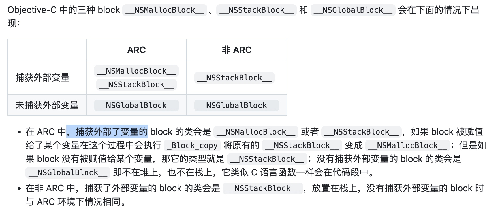

Block研究

# 0 Block是什么
Block在底层是一个结构体，包含isa指针、**持有一个funcPtr指向代码块转换后的方法地址**。
这句话其实解释了很多：
1.为什么默认情况下block在栈上？因为block是一个结构体类型的局部变量，而局部变量正是在栈上
2.为什么block内无法修改局部变量，但可以修改全局变量？因为block内代码被编译为一个方法，和访问的局部变量**不在同一个作用域**
3.为什么block内不会捕获全局变量？原因同上，因为是全局变量，可以直接访问


# 1 概念性总结
## 1.1 Block的类型
自动变量维基百科定义：进入作用域系统为其分配空间，离开作用域释放空间的一类变量。**等同于局部变量**

以下不管ARC还是MRC都成立
| 类型   | 定义                   | copy之后          | 捕获对象的引用计数 | 存储区域 | 内存回收策略 |
|--------|------------------------|-------------------|----------|-------|----|
| global | 没有捕获局部变量，或者只访问了全局变量(含静态全局)、**静态(局部)变量** | 无效果 | 不捕获|           数据区 | - |
| stack  | 捕获了局部变量 or 捕获成员变量也算；且没有被strong/copy关键字描述   | block被copy到堆上 | 不捕获对象,更不会增加引用计数??? | 栈区 | 超过作用域系统回收|
| malloc | stack 类型copy之后     | block引用计数加一  | 对于捕获的strong类型对象会retain，即copy一份 | 堆区 | 没有对象持有Block时，调用它的dispose函数释放 |

我理解这里的应该是不区分变量是基本数据类型还是对象类型吧，**核心在于作用域，而不在数据类型**

何为捕获？
即用clang重写后**block对应的结构中，是否有访问的变量**

所以就有Draveness更直白的分类(https://github.com/draveness/analyze/blob/master/contents/FBRetainCycleDetector/iOS%20%E4%B8%AD%E7%9A%84%20block%20%E6%98%AF%E5%A6%82%E4%BD%95%E6%8C%81%E6%9C%89%E5%AF%B9%E8%B1%A1%E7%9A%84.md)：



\
\
\
(局部)静态变量，全局静态变量，全局变量举例：
```
//全局变量
int global_i = 1;
//全局静态变量
static int static_global_j = 2;

int main(int argc, const char * argv[]) {
   //静态变量， 生命周期同app
    static int static_k = 3;
    
    return 0;
}
```


## 1.2 捕获变量分析

| 变量类型              | 捕获类型 |
|-|-|
| 全部变量、全局静态变量 | 不捕获   |
| 局部静态变量          | 指针捕获 |
| 局部基本数据类型              | 值捕获       |
| 局部对象              | 指针捕获       |

问：为什么局部变量捕获的是值，而 局部静态变量捕获的是指针？
因为block 可能会延迟调用，即超出变量的作用域，而auto变量超出作用域即销毁，所以要捕获它的值；而static则是一直存在的，那么只捕获一个指针即可

# 2 Block 中的Copy
## 2.1 ARC下copy的时机：
1.手动调用copy\
2.Block是函数的返回值。 需要注意的是block作为参数是不会自动copy的，因此需手动copy避免提前释放\
3.Block被强引用，Block被赋值给__strong类型变量\
4.Cocoa框架中入参含有usingBlcok；**CGD中的API**，如dispatch_after,dispatch_async

一个小想法为什么gcd会对block进行copy? 因为将任务提交到队列中，但是执行时机其实不确定，不过一般都会超过作用域吧，所以为了避免提前释放copy一下也正常。
原代码：先copy, 再release
```
void dispatch_async(dispatch_queue_t dq, void (^work)(void))
{
    dispatch_async_f(dq, _dispatch_Block_copy(work), _dispatch_call_block_and_release);
}
```

## 2.2 block发生copy会做的事：
首先应该区分block的类型，是global、还是stack、还是malloc。
global 的copy 无效果；stack copy 到堆上； malloc 则是 block 的引用计数加一。

特定的针对 stack 类型的copy 还有以下操作：
1.对于捕获的__strong 对象, 会对其进行retain, 引用计数会加一；当然在block释放的时候，会release
2.对于__block 变量在copy的时候，栈上__block变量的forwarding指针 也会指向堆上


## 2.3 Block为什么使用copy?
常规解释：
不进行copy，那么block在栈上，随着作用域结束block就被释放，不能保证正常调用。因此需要将block copy到堆上
第二层含义：
copy之后，block对捕获的__strong对象进行retain操作延长了它的生命周期，防止在block调用的时候被释放掉

# 3 __block 关键字

## 3.0 __block作用
解决block无法修改局部变量的问题。
为什么呢？
将局部变量转换为一个结构体，这个结构体持有这个变量(当时对象类型时，持有引用)；可以通过这个结构体修改变量；而block持有这个结构体的引用

## 3.1 __block变量的拷贝
1.当**block从栈拷贝到堆时**，如果它持有__block类型的变量也将一并被拷贝到堆区，且以后都是用堆上的block和__block变量。
2.如果多个block持有同一个__block变量，那么后面的拷贝，意味着__block变量引用计数的增加
3.只有在所有block对__block的引用都释放，这个变量才会释放
以上思考模式和引用计数一样

### 3.1.1 证明
```
 __block int a = 0;
   NSLog(@"copy前：%p", &a);         //栈区
   void (^foo)(void) = ^{
       a = 1;
       NSLog(@"block内部：%p", &a);    //堆区
   };
   NSLog(@"定义后：%p", &a);         //堆区
   foo();
```
打印信息：
```
copy前：0x16fda86f8
定义后：0x155b22fc8
block内部： 0x155b22fc8
```
1.block内部的变量会被copy到堆区，而从打印信息可以看到后两个是一样的，因此"定义后"访问的堆中block
2.如何证明呢
把三个16进制的内存地址转成10进制就是：
copy前：6171559672，block内部：5732708296，定义后：5732708296。
中间相差438851376个字节，也就是 418.5M 的空间，因为堆地址要小于栈地址，又因为 iOS 中主线程的栈区内存只有1M，Mac也只有8M，既然 iOS 中一条线程最大的栈空间是1M，显然a已经是在堆区了。

## 3.2 __block的原理

**将描述的对象生成为一个结构体**，block内捕获的变量会变为结构体类型的同名变量，从而扩展的变量的作用域
```
//block_obj变量变成了结构体
struct __Block_byref_block_obj_0 {
  void *__isa;
__Block_byref_block_obj_0 *__forwarding;
 int __flags;
 int __size;
 void (*__Block_byref_id_object_copy)(void*, void*);
 void (*__Block_byref_id_object_dispose)(void*);
 id block_obj; //block_obj变量的
};

struct __main_block_impl_0 {
  struct __block_impl impl;
  struct __main_block_desc_0* Desc;
  id obj;
  __Block_byref_block_obj_0 *block_obj; // by ref
  __main_block_impl_0(void *fp, struct __main_block_desc_0 *desc, id _obj, __Block_byref_block_obj_0 *_block_obj, int flags=0) : obj(_obj), block_obj(_block_obj->__forwarding) {
    impl.isa = &_NSConcreteStackBlock;
    impl.Flags = flags;
    impl.FuncPtr = fp;
    Desc = desc;
  }
};
```
以上为下面题目分析1中block捕获变量被装换的结构体

## 3.3 __block 中的forwarding指针
**forwarding成员变量在__block变量对应的结构体中，而不是在block对应的结构体中。**
栈block copy之后，无论栈还是堆上结构体的forwarding都指向堆上的__block 变量对应的结构体，因此它的效果是
> 无论__block变量在堆上还是在栈上，都能正确的访问__block变量

# 4 循环引用

1.arc下block用什么描述，为什么？
用copy/strong 都可以，在block赋值时，会对其进行copy操作，同时也对捕获的对象retain一次，防止在作用域过去之后，捕获的变量释放掉

2.weak-strong dance 解释
weak的作用：解除循环引用
strong的作用：防止在block执行的时候，weak指针指向的对象被释放；当block执行完成时，strong指针作用域结束，不会影响对象的释放
if (!strongSelf) { return;} 该代码作用：因为 weak 指针指向的对象，是可能被随时释放的。为了防止 self 在 block 外部被释放，比如其它线程内被释放。

最佳实践
```
__weak __typeof(self) weakSelf = self;
self.block = ^{
    __strong typeof(self) strongSelf = weakSelf;
    if (!strongSelf) {
         return;
    }
    NSLog(@"%@", @[strongSelf]);
};
self.block();
```

#  5 题目分析
## 题目1
```
__block id block_obj = [[NSObject alloc]init];

    id obj = [[NSObject alloc]init];

    NSLog(@"block_obj = [%@ , %p] , obj = [%@ , %p]",block_obj , &block_obj , obj , &obj);

    void (^myBlock)(void) = ^{

        NSLog(@"***Block中****block_obj = [%@ , %p] , obj = [%@ , %p]",block_obj , &block_obj , obj , &obj);

    };
    myBlock();
```
无论ARC还是MRC, 1和3都一样，因为是打印的对象地址
在ARC下，2和4 都变了，因为ARC下会对myblock(因为block被strong描述了)进行copy（浅拷贝）,因此指针是不同的
在MRC下，2不变，4变了。因为MRC不会对捕获的变量copy，2是通过forwarding指针的访问的，因此是一样的；所以4是block结构体新生成的指针，地址肯定不一样

考察知识：
- __block原理
- ARC下对__strong block的copy
- 对象和指针的打印
- 浅拷贝
```
//对应block中的打印操作
static void __main_block_func_0(struct __main_block_impl_0 *__cself) {
  __Block_byref_block_obj_0 *block_obj = __cself->block_obj; // bound by ref
  id obj = __cself->obj; // bound by copy

        NSLog((NSString *)&__NSConstantStringImpl__var_folders_45_k1d9q7c52vz50wz1683_hk9r0000gn_T_main_e64910_mi_1,(block_obj->__forwarding->block_obj) , &(block_obj->__forwarding->block_obj) , obj , &obj);
    }
```
参考文章：https://www.jianshu.com/p/ee9756f3d5f6

## 题目2
判断是否会循环引用
```
- (void)viewDidLoad {
    [super viewDidLoad];
    NSNotificationCenter *__weak center = [NSNotificationCenter defaultCenter];
    //直接使用 token 会有警告，block内使用了未初始化的变量，因此使用__block描述
    id __block token = [center addObserverForName:UIApplicationDidEnterBackgroundNotification
                                   object:nil
                                    queue:[NSOperationQueue mainQueue]
                               usingBlock:^(NSNotification * _Nonnull note) {
        [self doSomething];
        [center removeObserver:token];
    }];
}

- (void)doSomething {
    
}

```
1.会循环引用。token 持有block, block 持有token 造成引用循环；且block也持有的self 造成控制器也无法释放。

2.为什么token 会持有block？与系统实现有关，可打断点观察. 猜想token 应当保持了token，当通知事件触发时调用

3.解决办法
block内手动设置token = nil; （需要执行block 才可）
token也使用__weak说明符id __block __weak token。

链接：https://juejin.cn/post/6844904145283973127

### 扩展
以下写法虽然不会循环引用，但是NotificationCenter会持有block,而block 又持有self 造成内存泄漏。解决方案：block 内使用weakSelf.
```
[[NSNotificationCenter defaultCenter] addObserverForName:@"someNotification" 
                                                 object:nil 
                          queue:[NSOperationQueue mainQueue]
                                             usingBlock:^(NSNotification * notification) {
                                                   self.someProperty = xyz; }]; 
```
[参考链接：招聘一个靠谱iOS](https://github.com/ChenYilong/iOSInterviewQuestions/blob/master/01%25E3%2580%258A%25E6%258B%259B%25E8%2581%2598%25E4%25B8%2580%25E4%25B8%25AA%25E9%259D%25A0%25E8%25B0%25B1%25E7%259A%2584iOS%25E3%2580%258B%25E9%259D%25A2%25E8%25AF%2595%25E9%25A2%2598%25E5%258F%2582%25E8%2580%2583%25E7%25AD%2594%25E6%25A1%2588/%25E3%2580%258A%25E6%258B%259B%25E8%2581%2598%25E4%25B8%2580%25E4%25B8%25AA%25E9%259D%25A0%25E8%25B0%25B1%25E7%259A%2584iOS%25E3%2580%258B%25E9%259D%25A2%25E8%25AF%2595%25E9%25A2%2598%25E5%258F%2582%25E8%2580%2583%25E7%25AD%2594%25E6%25A1%2588%25EF%25BC%2588%25E4%25B8%258B%25EF%25BC%2589.md#35-bad_access%25E5%259C%25A8%25E4%25BB%2580%25E4%25B9%2588%25E6%2583%2585%25E5%2586%25B5%25E4%25B8%258B%25E5%2587%25BA%25E7%258E%25B0)


## 题目3
```
static TestViewController * staticVC;

- (void)testStatic {
    __weak TestViewController *weakSelf = self;
    staticVC = weakSelf;
}
```
staticVC 也持有VC对象，虽然是通过weak指针赋值，所以会有一个静态变量一直持有控制器，所以在使用完应该在合适的时机释放

## 题目4
```
- (void)testHeap {
    int a = 10;
    //默认是__strong描述的，因此这个是个堆block
    void(^blk)(void) = ^{
        NSLog(@"%d", a);
    };
    
    //dispatch_after 会对block 拷贝，延长block的生命周期，所以这样写没有问题
    dispatch_after(dispatch_time(DISPATCH_TIME_NOW, (int64_t)(3 * NSEC_PER_SEC)), dispatch_get_main_queue(), ^{
        blk();
    });
}
```

## 题目5
```
- (void)testStack {
    int a = 10;
    //栈上
    void(__weak ^blk)(void) = ^{
        NSLog(@"%d", a);
    };
    
    //堆
    dispatch_block_t block = ^{
    //延迟3秒触发的时候，blk已经释放了
        blk();
    };
    /*
    一种改法：
    dispatch_block_t block = blk; (疑问的地方：虽然block是strong描述的，但是它却是stack 类型的block; 一种解释时，这样写法相当于结构体的赋值，因此block也是stack类型是说的通的)
    至此都在栈上，在gcd中会对block copy到堆上，延长了声明周期
    */
        
    dispatch_after(dispatch_time(DISPATCH_TIME_NOW, (int64_t)(3 * NSEC_PER_SEC)), dispatch_get_main_queue(), ^{
        block();
    });
    
    
}
```

## 题目6
下面的strongBlock 分别使用 weak 和 strong描述，分析weakBlk是否可以正常执行
**前置知识：`weakBlk = strongBlock;`block在底层是结构体，所以这个赋值也即结构体赋值，所以两个block有相同的isa, funcptr也指向相同的函数。**

**不好意思，解释不通！！！
同样都是赋值操作，虽然strongBlock 一次在栈上一次在堆上，但超过作用域都应该释放了，为什么在栈上就可以，在堆上就不可以？？？**

1.使用weak 
```
- (void)testBlock2 {
    int a = 10;
    void(__weak ^weakBlk)(void) = nil;
    {
        void(__weak ^ strongBlock)(void) = ^{
            NSLog(@"%d", a);
        };
        weakBlk = strongBlock;
        NSLog(@"%@",[weakBlk class]); //stack
        NSLog(@"%@",[strongBlock class]); //stack
        //strongBlock block释放，但是weakBlk依然有值，也指向同样的函数,因此可以正常执行
    }
    weakBlk();
}
```

2.使用strong
```
- (void)testBlock2 {
    int a = 10;
    void(__weak ^weakBlk)(void) = nil;
    {
        void(^ strongBlock)(void) = ^{
            NSLog(@"%d", a);
        };
        weakBlk = strongBlock;
        NSLog(@"%@",[weakBlk class]); //malloc
        NSLog(@"%@",[strongBlock class]); //malloc
        //strongBlock block释放，但是weakBlk依然有值，也指向同样的函数,因此可以正常执行 ???
    }
    weakBlk();
}
```


