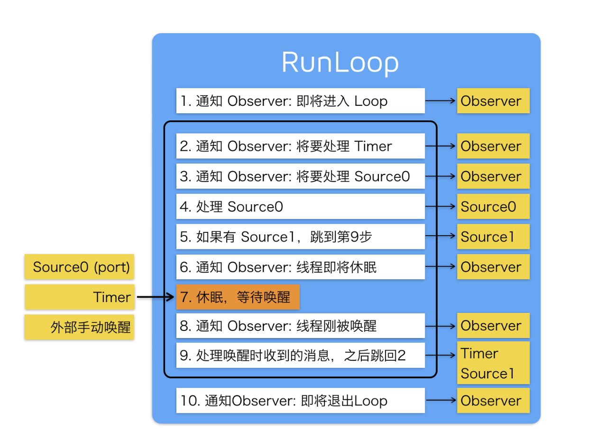

iOS Runloop
## 1 Runloop 拾遗
### 1.runloop的关键：
>如何管理事件/消息，如何让线程在没有处理消息时休眠以避免资源占用、在有消息到来时立刻被唤醒。

### 2.NSRunloop与CFRunloop的关系
CFRunLoopRef 是在 CoreFoundation 框架内的，它提供了纯 C 函数的 API，所有这些 API 都是线程安全的。
NSRunLoop 是基于 CFRunLoopRef 的封装，提供了面向对象的 API，但是这些 API 不是线程安全的。

### 3.RunLoop 与线程的关系
pthread_t 和 NSThread 是一一对应的，线程与Runloop也是一一对应的，他们的对应关系存储在全局的字典中。
RunLoop 的销毁是发生在线程结束时(runloop没有source也会exit)。你只能在一个线程的内部获取其 RunLoop（主线程除外）

### 4.Mode
每次调用 RunLoop 的主函数时，只能指定其中一个 Mode，这个Mode被称作 CurrentMode。如果需要切换 Mode，只能退出 Loop，再重新指定一个 Mode 进入。这样做主要是为了分隔开不同组的 Source/Timer/Observer，让其互不影响。

### 5.Source
Source1是基于Port的，用来处理进程间通信，可以主动唤醒runloop；
source0不能唤醒,使用时先调用 CFRunLoopSourceSignal(source)，将这个 Source 标记为待处理，然后手动调用 CFRunLoopWakeUp(runloop) 来唤醒 RunLoop，让其处理这个事件
### 6.Item
Source/Timer/Observer 被统称为 mode item，一个 item 可以被同时加入多个 mode。但一个 item 被重复加入同一个 mode 时是不会有效果的。如果一个 mode 中一个 item 都没有，则 RunLoop 会直接退出，不进入循环。

### 7.关于commonMode
Runloop中有一个commonModes的集合，存储加入其中的Mode name。系统默认将kCFRunLoopDefaultMode和UITrackingRunLoopMode两个mode加入其中。

当事件触发时，会判断current mode是否在commonMode中，如果在其中，那么它的Item将得到回调

### 8.都有哪些操作会唤醒runloop
- Timer：最简单如定时器，`performSelecter:afterDelay:`, `performSelector:onThread`内部也会创建Timer添加到当前runloop
- Source1: 接受网络数据，接受触摸事件
- gcd dispatchMainQueue

### 9.状态
```
typedef CF_OPTIONS(CFOptionFlags, CFRunLoopActivity) {
    kCFRunLoopEntry = (1UL << 0), //进入runloop
    kCFRunLoopBeforeTimers = (1UL << 1), //处理timers之前
    kCFRunLoopBeforeSources = (1UL << 2), //处理source之前
    kCFRunLoopBeforeWaiting = (1UL << 5), //代表一个时间段:睡眠之前,等待唤醒的一段时间
    kCFRunLoopAfterWaiting = (1UL << 6), //代表一个时间段:唤醒之后,处理事件之前的一段时间
    kCFRunLoopExit = (1UL << 7), //退出了runloop
    kCFRunLoopAllActivities = 0x0FFFFFFFU
};
```

### 10.处理流程
1. 通知observer，进入runloop
2. 通知observer，即将处理timer
3. 通知observer，即将处理source0
4. 处理source0, 在这个前后会插入performBlock
5. 如果有被source1唤醒的事件，跳去执行事件
6. 通知observer，即将睡眠
7. Timer/Source1/dispatchMain 唤醒runloop
8. 通知observer，即将唤醒
9. 处理对应的事件，performBlock，跳回到第二步
10. 退出runloop




## 2题目
### 题目1 app如何接收到触摸事件的

简单来说：系统向主线程runloop注册了source1事件，它是用来处理进程间通信的，当触摸事件发生时，桌面程序向app发消息，source1事件触发；app内部进一步分发为source0事件，它是用来处理触摸/滚动的，它将事件包装为UIEvent 调用UIApplication的sendEvent方法，进而触发hitTest寻找最佳响应者

1.硬件接受到事件，传递给`IOKit.framework`包装成`IOHIDEvent`事件通过进程间通信的方式发送出去
2.SpringBoard.app即桌面App收到消息之后，经过一系列处理，发送给前台进程的Source1
3.每一个iOS程序的主线程runloop，都注册一个source1，回调是`__IOHIDEventSystemClientQueueCallback()`。当它收到事件后，内部又分发为Source0，而source0是处理自定义的事件的，如触摸、滚动、selector等，它接收到`IOHIDEvent`就会把它转换成我们熟悉的`UIEvent`事件，然后调用`UIApplication`示例的`sendEvent`方法将事件传递给window
4.hit-test 寻找最佳响应者
```
- (UIView *)hitTest:(CGPoint)point withEvent:(UIEvent *)event{ 
  // 1. 前置条件要满足       
  if (self.userInteractionEnabled == NO || 
  self.hidden == YES ||  
  self.alpha <= 0.01) return nil;
  
  // 2. 判断点是否在视图内部 这是最起码的 note point 是在当前视图坐标系的点位置
    if ([self pointInside:point withEvent:event] == NO) return nil;

  // 3. 现在起码能确定当前视图能够是响应者 接下去询问子视图
    int count = (int)self.subviews.count;
    for (int i = count - 1; i >= 0; i--)
    {
      // 子视图
        UIView *childView = self.subviews[i];
    
    // 点需要先转换坐标系        
        CGPoint childP = [self convertPoint:point toView:childView];  
        // 子视图开始询问
        UIView *fitView = [childView hitTest:childP withEvent:event]; 
        if (fitView)
        {
      return fitView;
    }
    }
                         
    return self;
}
```

### 题目2 为什么只有主线程的runloop是开启的

因为主线程需要runloop 去处理事件，包括点击事件/Timer/UI刷新等；子线程默认是没有runloop，且runloop中需要Item 才能正常运行，不然就会exit，而系统并不能预见开发者想添加哪些Item，所以就没有给子线程创建runloop

### 题目3 为什么只在主线程刷新UI
1.UIKit不是线程安全的，如果可以在其他线程刷新UI，则需要大量的线程同步代码
2.UI的刷新依赖Runloop在exit和beforeWaiting时提交绘制信息到RenderServer，子线程没有这一机制，需要自己实现
3.即便实现了上面的机制，那么不同线程Runloop的状态是不一样的，如果协调同步提交的UI信息也是一个问题
4.理想情况下，在1/60s完成图层树的准备工作并提交给渲染进程。如果有多个线程提交任务，那么哪些图层树系统要怎么处理呢？也都是问题

### 题目4 PerformSelector和runloop的关系
`PerformSelector` 有两种，一种是无delay的，相当于`objc_msgSend`；另一种是有delay的，需要在当前线程创建Timer 并添加到Runloop，如果没有runloop则是不能执行的。

#### 扩展1
无runloop，perform方法不会执行
```
- (IBAction)test01:(id)sender {
    dispatch_async(self.concurrencyQueue2, ^{
        NSLog(@"[1] 线程：%@",[NSThread currentThread]);
        // 当前线程没有开启 runloop 所以改方法是没办法执行的
        [self performSelector:@selector(perform) withObject:nil afterDelay:0];
        NSLog(@"[3]");
    });
}

- (void)perform {
    NSLog(@"[2] 线程：%@",[NSThread currentThread]);
}
```

#### 扩展2
改动一下. 
```
- (IBAction)test01:(id)sender {
    dispatch_async(self.concurrencyQueue2, ^{
        NSLog(@"[1] 线程：%@",[NSThread currentThread]);
        NSRunLoop *runloop = [NSRunLoop currentRunLoop]; 
        [self performSelector:@selector(perform) withObject:nil afterDelay:0];// 这里打断点，po runloop ，查看执行这条语句后runloop添加了啥
        [runloop run];
        NSLog(@"[3]");
    });
}
```
输出如下内容。3也被输出，说明runloop执行完timer任务就exit了，runloop没有起到保活线程的作用
```
2020-04-07 00:16:43.146357+0800 04-06-performSelector-RunLoop[15486:585028] [1] 线程：<NSThread: 0x6000000cdd00>{number = 6, name = (null)}
2020-04-07 00:16:43.146722+0800 04-06-performSelector-RunLoop[15486:585028] [2] 线程：<NSThread: 0x6000000cdd00>{number = 6, name = (null)}
2020-04-07 00:16:43.146932+0800 04-06-performSelector-RunLoop[15486:585028] [3]
```

#### 扩展3
```
- (IBAction)test01:(id)sender {
    dispatch_async(self.concurrencyQueue2, ^{
        NSLog(@"[1] 线程：%@",[NSThread currentThread]);
        NSTimer *timer = [NSTimer timerWithTimeInterval:1 repeats:YES block:^(NSTimer * _Nonnull timer) {
            NSLog(@"timer 定时任务");
        }];
        
        // 当前线程没有开启 runloop 所以改方法是没办法执行的
        NSRunLoop *runloop = [NSRunLoop currentRunLoop];
        [runloop addTimer:timer forMode:NSDefaultRunLoopMode];
        [self performSelector:@selector(perform) withObject:nil afterDelay:0];
        [runloop run];
        NSLog(@"[3]");
    });
}
```
3不会执行，添加的timer使得线程保活，**run方法内部的while循环一直执行**，3不会被打印。

### 题目5 如何使线程保活
添加Timer，Port，Source到Runloop即可。
可参考：https://github.com/Yuan91/runloop/blob/master/LongThread.m
需要注意的是：Timer的Repeat要为TRUE; run方法无法停止，可以调用`CFRunLoopRunInMode(kCFRunLoopDefaultMode, 1.0e10, false);`或者`[[NSRunLoop currentRunLoop] runMode:NSDefaultRunLoopMode beforeDate:[NSDate distantFuture]];`

## 应用
- timer添加到commonMode，让它在trackingMode也能工作
- 滑动时 不播放动画，加载图片，提高帧率
- 类似的还用displayLink。 但是它可实现其他功能，比如限流 根据屏幕刷新率，限制进度回调频率，限制滑竿滑动时 做效果的频率
```
- (CADisplayLink *)displayLink {
    if (!_displayLink) {
        _displayLink = [CADisplayLink displayLinkWithTarget:self selector:@selector(displayLinkOffscreenRendering)];
        [_displayLink addToRunLoop:[NSRunLoop currentRunLoop] forMode:NSRunLoopCommonModes];
    }
    return _displayLink;
}

- (void)displayLinkOffscreenRendering {
    /// 渲染进度
    CGFloat progress = [self getRenderProgerss];
    if (progress < 1.0) {
        if (self.progress) {
            self.progress(progress);
        }
    }     
```


为什么线程没有runloop会exit？
runloop又是如何处理触摸事件/定时器事件/界面刷新/autoreleasepool 等
runloop是如何切换mode的
性能优化
commons是个什么概念

处理block的逻辑。
判断block的mode是否和当前rl的mode相同 或者 commonModes是否包含当前的mode，如果包含就执行。且这个操作是在while循环中，遍历block的链表  
```
 struct _block_item *prev = NULL;
    struct _block_item *item = head;
    while (item) {
        struct _block_item *curr = item;
        item = item->_next;
	Boolean doit = false;
	if (CFStringGetTypeID() == CFGetTypeID(curr->_mode)) {
	    doit = CFEqual(curr->_mode, curMode) || (CFEqual(curr->_mode, kCFRunLoopCommonModes) && CFSetContainsValue(commonModes, curMode));
        } else {
	    doit = CFSetContainsValue((CFSetRef)curr->_mode, curMode) || (CFSetContainsValue((CFSetRef)curr->_mode, kCFRunLoopCommonModes) && CFSetContainsValue(commonModes, curMode));
	}
	if (!doit) prev = curr;
	if (doit) {
	    if (prev) prev->_next = item;
	    if (curr == head) head = item;
	    if (curr == tail) tail = prev;
	    void (^block)(void) = curr->_block;
            CFRelease(curr->_mode);
            free(curr);
	    if (doit) {
                __CFRUNLOOP_IS_CALLING_OUT_TO_A_BLOCK__(block);
	        did = true;
	    }
            Block_release(block); // do this before relocking to prevent deadlocks where some yahoo wants to run the run loop reentrantly from their dealloc
	}
    }
```


# 卡顿检测
## 如何检测
给主线程添加runloop的observer，然后创建子线程持续的观察主线程的状态，主要是beforeSource和afterWaiting，当处在这两个状态超过一定的时间，即认为是卡顿.
## 为什么选择这两个状态
**首先说明：选择这两个状态，不是说计算他们之间的差值来判断卡顿的，而是说如果长时间处于这个状态，就可以认为是卡顿。**

afterwaiting的原因，runloop被唤醒之后会发出这个通知，然后开始处理唤醒事件，如timer/点击事件/gcd事件，处理完之后变成beforetimer，而如果检测到一直出在afterwaiting，那就说明处理了耗时事件

beforesource也是同理，通知发出之后开始处理事件，如果长时间停留在该状态也说明发生了耗时事件。系统的很多事件，是通过这个source0执行的，如网络
## 阈值如何选择
主程序 Runloop 超时的阈值是 2 秒。子线程的检查周期是 1 秒，每隔 1 秒子线程检查主线程的运行状态；如果检查到主线程 Runloop 运行超过 2 秒则认为是卡顿，并获得当前的线程快照

## 优化
1. 如果CPU过高，如占用超过80%也可认为是卡顿
2. 卡顿时捕获到的日志，先不写入文件。如果下一次是不同的卡顿日志在写入；如果是相同的，已斐波那契数列递增检查的事件。这样可以避免重复写入，以及写入时的资源浪费
3. 上报优化，分析卡顿日志大小，即便较小，但是用户量较大，那对服务器来说也是很大的压力，最好是抽样上报