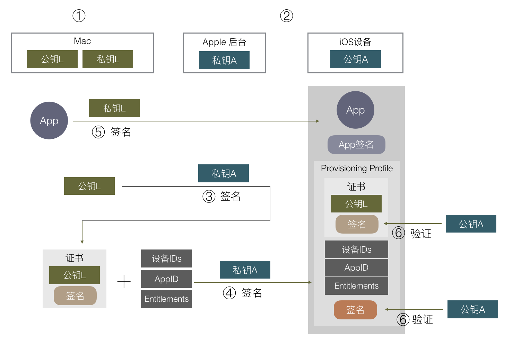

# 安全相关
## 0.关于越狱
1.越狱之后，系统会默认带有一个mobilesubstrate的动态库，它的作用是系统一个系统级的管道，所有的tweak都可以依赖它来开发
2.越狱之后，app权限变大，可以访问沙盒之外的路径
3.重签和动态库注入是不需要越狱的
4.攻击者一般通过动态库注入，然后重签的方式来攻击App

## 1.防止重签名
从embedded.mobileprovision文件中取出teamid

关于重签名的原理，内容过多，在下面详细介绍

## 2.hash 计算
目的：防止资源文件被篡改

策略：
1.对于特定类型的文件，如json/pdf/png 等计算其md5，将所有计算结果拼接一起在重新计算一次md5，与plist中的相对比。

2.过滤掉framework中的内容，只计算宿主工程的。


说明：Apple针对Asset里面的文件有优化，不同的机型，只会下载指定的图片，如iPhoneX就只下载3x的，那么这是否会影响文件hash的计算呢？

答：并不会，因为Asset里面的文件，在安装包里是Assets.car格式，不属于指定的计算类型。

## 3.越狱机检测
### 方法1：检查是有特定的路径（主要是App或动态库），如
```
/Applications/Cydia.app

/private/var/lib/apt/

/Library/MobileSubstrate/MobileSubstrate.dylib
```
检查方法：`FileManager.shared.fileExistsAt:path`检查文件是否存在。（但是此方法，可能被runtime hook掉）
检查方法2：通过C语言API, `stat `函数获取文件的属性，如果返回0则表示获取成功，即存在对应的路径。（但是此方法，可能被fishhook）

如果防止fishhook 可参考后面的内容

### 方法2：检查动态库注入
通常情况下，越狱机通常会被注入一些异常的动态库如：Library/MobileSubstrate/MobileSubstrate.dylib ，我们可以通过检测它（_dyld_get_image_name）判断是否是越狱设备。当然攻击者可能会给 MobileSubstrate 改名，但是原理都是通过 DYLD_INSERT_LIBRARIES注入动态库，通过检测当前程序运行的环境变量，未越狱设备返回结果是 null ，越狱设备就各有各的精彩了
```
// load any inserted libraries
        if  ( sEnv.DYLD_INSERT_LIBRARIES != NULL ) {
            for (const char* const* lib = sEnv.DYLD_INSERT_LIBRARIES; *lib != NULL; ++lib) 
                loadInsertedDylib(*lib);
        }
        // record count of inserted libraries so that a flat search will look at 
        // inserted libraries, then main, then others.
        sInsertedDylibCount = sAllImages.size()-1;
```

### 方法3： 检测文件夹权限
1.可尝试向`private/uuid`路径下写入文件，只有越狱设备才有这个权限
```
NSString *path = [NSString stringWithFormat:@"/private/%@", [self stringWithUUID]];
    if ([@"test" writeToFile : path atomically : YES encoding : NSUTF8StringEncoding error : NULL]) {
        [[NSFileManager defaultManager] removeItemAtPath:path error:nil];
        RLogInfo(@"detected /private/:uuid is writable, it is a jailbroken device.");
        isJailbrokenDevice = YES;
    }
```
2.可以尝试获取`/User/Applications/`内容，非越狱设备可获取不到


### 方法4 fork processing
只有越狱设备才可以通过fork函数创建子进程。


参考链接：

https://www.theiphonewiki.com/wiki/Bypassing_Jailbreak_Detection
https://wiki.jikexueyuan.com/project/ios-security-defense/prison-break.html
https://github.com/ibireme/YYKit/blob/master/YYKit/Base/UIKit/UIDevice%2BYYAdd.m

## 4.防止动态库注入
动态库注入需要先脱壳，图省事可以直接使用第三方市场下载的安装包
动态库注入的几种方式：
### 修改MachO
通过修改MachO的LoadCommand，添加`LC_LOAD_DYLIB`，将其指向自定义的动态库。然后在重签。
该方法不需要越狱环境

### MobileSubstrate
越狱手机可以在该路径下添加动态库`/Library/MobileSubstrate/DynamicLibraries`，里面的dylib会有一个plist标识哪些进程会加载这个库.

### 环境变量
使用方式。越狱设备使用
```
DYLD_INSERT_LIBRARIES=test.dylib /var/mobile/Containers/Bundle/Application/143A710D-4395-4765-872C-148EA6C86936/WeChat.app/WeChat
```
注入的动态库，在程序启动的时候会加载
```
// load any inserted libraries
if  ( sEnv.DYLD_INSERT_LIBRARIES != NULL ) {
    for (const char* const* lib = sEnv.DYLD_INSERT_LIBRARIES; *lib != NULL; ++lib) 
        loadInsertedDylib(*lib);
}
```

以上参考：https://www.jianshu.com/p/9153ca123fec

_dyld_image_count() 获取App动态库的数量，_dyld_get_image_name获取具体的动态库名称。

app bundle路径后的动态库不在白名单则是恶意注入的动态库，或者在黑名单也是注入的。

注：从_dyld_image_count()获取到的手机内所有的动态库，需要剔除不在app bundle路径的，才是我们需要检测的

## 5. 反调试
利用ptrace
```
//request: 选择PT_DENY_ATTACH
//pid: 0即当前进程
//addr和data 写0
ptrace(request, pid, addr, data)
```

使用fishhook可以破解ptrace 

## 6.防止fishhook
上面的ptrace, stat, fork函数，如果被fishhook，那么也会造成我们检测结果的不准确。
**解决方案如下，使用`dladdr`函数，它可以获取到函数对应的模块、名称、地址**
系统函数声明
```
/*
 * Structure filled in by dladdr().
 */
typedef struct dl_info {
        const char      *dli_fname;     /* Pathname of shared object */
        void            *dli_fbase;     /* Base address of shared object */
        const char      *dli_sname;     /* Name of nearest symbol */
        void            *dli_saddr;     /* Address of nearest symbol */
} Dl_info;

extern int dladdr(const void *, Dl_info *);
```

使用，以stat为例，如果结果不是系统的`/usr/lib/system/libsystem_kernel.dylib`，那么必然是被攻击了
```
#import <dlfcn.h>
#include <sys/stat.h>

void checkInject(void)
{
    int ret ;
    Dl_info dylib_info;
    int (*func_stat)(const char *, struct stat *) = stat;
    if ((ret = dladdr(func_stat, &dylib_info))) {
        NSLog(@"lib :%s", dylib_info.dli_fname);
    }
}
```

## 7.关于当前检测方案的问题
1.函数命名明显：
攻击者dump之后，可以很快速的找到攻击的方法或函数
2.退出机制
发现恶意攻击之后，通过exit立马退出程序太过明显。一是对方可能hook这个函数，二是立马退出给了对方线索
3.保护机制
退出程序成本太低，可采用上报用户信息、冻结账号等方式
4.动态库注入,**有一个待验证的结论是：DYLD_INSERT_LIBRARIES插入的库会先于其他库加载。** 因此，如果我在插入的库，hook掉了关键的函数，那防护方案是不是就不起效果了呢？

参考：https://iosre.com/t/ios/5440/2

# 接口请求安全保证
## 1.请求签名
1、数据准备，获取到请求method，url，排序后的query，一些关键的httpHeader。将以上拼接转换为Data

2、再拼接上httpBody

3、获取加密key，不同场景的加密key不一样，大致分为三类：未登录，已登录，交易加密。（每个用户都有一个randomKey登录时返回，将这个key，拼接上app本地针对每个请求生成的数据，形成最终的key）

4、通过HMAC_SHA256加密算法 以及第三步获取的key 对前两步生成的data加密

## 2.请求数据加密
1. 获取加密key，不同场景加密key不一样(和请求签名第三点一样)。
2. 对body数据进行AES对称加密，key是上一步生成的，body为原请求中的body
3. 生成新的body base64 Encode之后，赋值给request传递给服务端

## 3.交易加密
1. 原料：pwd.md5，uin，salt，randomkey
2. 将以上数据分部，采用不同的加密算法，最终生成一个Auth传递给服务端

## 4. 证书校验
https的证书校验

# 重签名原理
要想了解重签的原理，就需要了解清楚签名的原理：https://wereadteam.github.io/2017/03/13/Signature/

最简单的签名原理，就是一对公私钥的非对称加密算法，私钥在Apple服务器，公钥在iPhone手机，安装的时候使用公钥解密签名，同时对MachO计算签名进行比对。这个过程就和https的证书校验是一模一样的。

但是实际中会有以下问题：
1.开发调试不方便，因为开发时，总不可能打个包去让苹果签名吧
2.需要对调试设备和App权限进行验证。

基于此Apple推出了，双层校验和描述文件机制。
双层校验：除了Apple和iPhone上的公私钥之外，还有一对Mac电脑(开发者)的公私钥。
调试设备和App权限的控制：在描述文件中添加对应的描述，使用Apple私钥对这个描述文件加密，打包的时候带进去。

安装/启动的时候：
1.使用iPhone上的公钥，验证描述文件，确保设备、权限、bundleId、teamid等是正常的。即确保开发者是合法的。同时这一步也得到了开发者的公钥
2.使用开发者公钥解密签名，对MachO文件计算签名，比对



整体流程如上。

那么重签的关键地方在于：
1.使用重签方的私钥重签App，即标号⑤
2.将假bundle对应的描述文件，放入安装包

工具：
1.命令行codesign
2.其他GUI工具