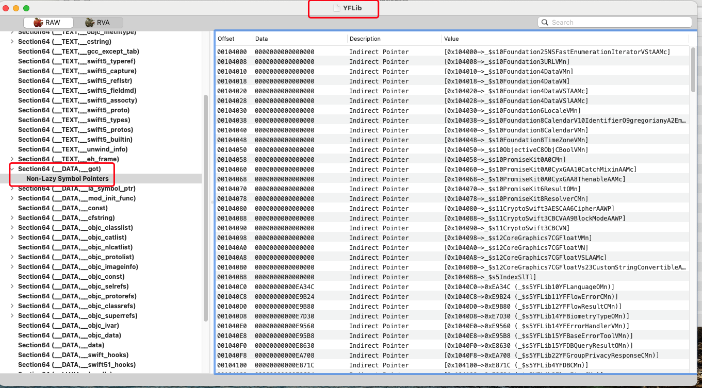
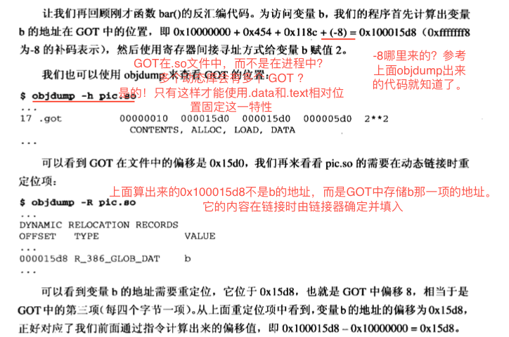

# 《程序员的自我修养--第七章--动态链接》

## 静态库和动态库的对比
1.直观的对比
|      | 静态库 | 动态库 |
|------|--------|--------|
| 优点 |不用考虑版本兼容的问题以及库是否存在|共享库多个进程共享，减少了硬盘/内存/的占用，降低内存换入换出的几率，增加CPU缓存的命中率|
| 缺点 |浪费硬盘，内存，模块更新困难        | 对安装环境有要求，降低了性能与启动速度(约5%)       |

2.其他差异
2.1 **静态链接的程序，会将所有引用的静态库链接到一起，生成一个可执行文件，所有符号的地址链接之后就确定了；动态链接的程序，除了主程序的可执行文件外，还会有若干共享库，且外部引用共享库中的符号，要等到装载/使用的时候，才能确定地址**
2.2 除此之外，动态库可以延迟加载，也可以提高启动速度吧
2.3 程序升级时：使用动态库只需要把目标文件替换；使用静态库需要重新打包分发
2.4 动态库升级后，可能会出现新旧模块之间接口不兼容，导致原有程序无法运行的问题

3.动态库慢的原因
启动慢的原因：程序启动时，多了动态链接器的装载，以及符号查找和重定位的过程。
运行慢的原因：全局数据的访问和函数的调用，都要经过GOT的中转，且实现相对静态库多个一些指令，因此会慢

## 动态链接的思想
1.将程序按照模块分为若干独立的部分，动态链接的程序在链接之后，并不能完成所有符号的解析和重定位，这部分工作被推迟到了装载时，由系统的动态链接器完成。动态链接器将程序中所有未决议的符号绑定到相应的动态库中，并进行重定位工作。

2.链接器在链接时会对符号进行重定位，如果是定义在静态库中的符号，会按照静态链接的规则进行重定位；如果是动态库的符号，那么就将这个符号标记为动态链接的符号，不对它进行重定位，等到装载时在进行。

如何确定是静态符号，还是动态符号？

链接时，会将动态库也作为输入，这样链接器在解析符号的时候就知道了。
以MachO为例，可执行文件中的Indirect Symbols存储了动态链接的符号。

3.动态链接器与普通共享对象一样会被映射到进程的地址空间，在系统启动用户程序之前，首先会把程序的控制权交给动态链接器，由它完成所有的动态链接工作以后再把控制权交给用户程序

4.共享对象的最终装载地址在编译链接时是不确定的，而是在装载时，由装载器根据当前地址空间的空闲情况，动态分配一块足够大小的虚拟地址空间给相应的共享对象。也就是说同一个共享库，在不同进程的地址空间的装载位置是不确定的。

## 地址无关代码

### 共享库的指令为什么要地址无关？
装载时重定位：根据程序/库的装载地址，修改指令的地址。

因为共享库的指令部分会被多个进程共享，如果采用装载时重定位，这样会导致指令中包含符号的绝对地址，没有办法做到同一份指令被多个进程共享。因为共享库在每个进程被装载的地址是随机的，那么重定位后的指令部分，对于每个进程来说也是不同的。

### 共享库的数据使用绝对地址的问题
而数据段是每个进程都有一个独立的副本，不用担心被进程改变，所以针对数据段中绝对地址引用的问题，可以使用装载时重定位的方法。对于共享对象来说，如果数据段有绝对地址引用，那么编译器和链接器就会产生一个重定位表。

### 实现地址无关代码的基本思想
目的：程序中共享指令的部分在装载时，不需要因装载的地址改变而改变。

基本思想：把指令中那些需要被修改的部分抽离出来，跟数据放到一起，这样指令部分就可以保持不变，而数据部分可以在每一个进程中拥有一个副本。这种方案就是地址无关代码技术（PIC, Position Independent Code）


### 动态库内地址无关代码的实现
分为四种情况
|          | 函数调用 | 数据访问 |
|----------|----------|---------|
| 模块内   | 相对偏移     |PC寄存器 + 偏移量         |
| 模块外部 |PC寄存器 + 偏移量 + GOT          |PC寄存器 + 偏移量 + GOT          |

动态库/共享库装载的时候，作为一个整体装载到进程的地址空间，虽然装载地址不确定，但是.text和.data的相对距离是确定的，使用这一特性可以完成模块内函数和数据的访问；**在.data添加一个GOT（Global offset table 全局偏移表）来存储模块外部函数和数据地址，.text和GOT的偏移量也是确定的，那么就可以通过`PC寄存器 + 偏移量 + GOT`来确定外部符号的地址。**

**编译器为每一个动态库生成一个GOT,它用来存储动态库内引用的外部符号的地址；链接器在装载模块时，会查找每一个符号的地址，并将它填到GOT中对应的项。由于GOT本身是放在.data，所以它可以在模块装载时被修改，并且每个进程都有独立的副本，相互之间不影响。**

YFLib的GOT示例



#### 模块内函数调用
示例代码


dump之后

动态库内，bar和foo的地址是确定的，且不管装载到哪里它们的相对地址都是固定的，即-24（0xffffffe8的补码）。假设共享库被装载到地址X，那foo的地址就是：X + 0x804835c(PC寄存器的值) + (-24)

#### 模块内数据访问

模块内任意一条指令和它所访问的同模块的数据的相对位置是固定的。
**call指令的两个作用：将下一条指令的地址存储PC寄存器，并将栈顶指针esp指向它；跳转到调用的子程序。**
1.通过一个call指令，获取PC寄存器的值，在这个例子中是 0x454
2.PC值 + 0x118c. 0x118c是当前指令到.data的距离
3.在上一步的基础上再加 0x28。0x28是变量a距离.data起始位置的值
4.因此在动态库内变量a的地址是： PC(0x454) + 0x118c + 0x28。
5.假设共享库被装载到X，则装载后a的地址是：X + PC(0x454) + 0x118c + 0x28

#### 模块外数据访问
在.data中添加GOT，它是ELF文件中的section，存储引用外部符号的地址。并且GOT位置和指令中引用外部符号的间距也确定，即可由PC + 偏移量，找到GOT在从GOT获取引用外部符号的地址。即：
```
0x454 + 0x118c + (-8) = 0x15d8
0x454: PC寄存器
0x118c： 指令位置和.data的距离
-8: 看上面dump代码，是0xfffffff8的补码标识
```
0x15d8是存储外部变量b的项，在共享库中的地址。

验证：
通过objdump 看看GOT的地址为0x15d0,GOT中b的偏移量为0x15d8



#### 模块外函数调用
同上面一种情况，只是GOT中存储的是指令的地址。


