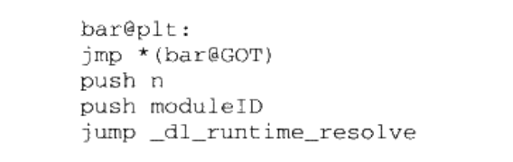

# 《程序员的自我修养--第七章--动态链接2》

## 延迟绑定的实现

### 概念
延迟绑定：程序执行过程中有些功能可能并不会用到，所以在加载时完成所有符号的重定位是没有必要的，可以将这一过程推迟到运行时。


### 实现的思路：
1.在调用GOT之前，添加一个GOT.PLT在装载时，动态链接器向其中填入重定位所需的参数：发生重定位的模块和引用的符号；
2.当引用外部符号的程序执行时，调用动态链接器的函数，使用之前保存的参数，找到引用符号的地址，将其保存在GOT.PLT中，并跳过去执行
3.下一次在调用时，因为地址已经保存在GOT.PLT中，直接去执行不需要再次查找。

### 举例
假定模块A引用了外部符号bar，这是GOT.PLT的结构

1.在程序装载时，将第二条指令的地址，存储到bar@GOT中，那么第一条指令相当于一个跳转，这个操作成本很低，不会耗费性能。第三条指令存储一个参数moduleID。参数含义：moduleID调用发生的模块，n是bar这个符号在重定位表中的索引。
2.当程序指令到调用处，由动态连接器调用_dl_runtime_resolve结合n和moduleID这两个参数，去查找bar这个符号的地址，并将他填入到 bar@GOT中，同时执行
3.下次执行到调用出，因为bar@GOT已经是bar的地址，所以无需查找直接执行就好。

## 动态链接其他内容

### 动态链接情况下，进程的启动过程
1.装载进程的可执行文件(**这一步参考装载那一章，需要创建虚拟地址空间和物理内存的映射，创建虚拟地址空间和可执行文件的映射**)
2.将动态链接器加载到进程的地址空间中(动态链接器的自举)，将控制权交给动态链接器，**由它完成动态库的装载和可执行文件中对于外部符号引用的链接**
3.链接完成之后，将控制权交给可执行文件的入口地址。

说明：动态链接器也是一个动态库，为了避免鸡生蛋蛋生鸡的问题，动态链接器本身不能依赖其他任何共享对象；且动态链接器本身的全局变量和静态变量的重定位由它本身完成。像这种有一定限制的启动代码叫做自举(Bootstrap)

### 相关的段
1". interp."存储动态连接器的路径，由ELF文件指定
2.Rebase(基址重置)
需要Rebase的背景：共享对象数据段中对数据的绝对地址使用。
```
static int a;
//指针p的值是一个绝对值，它指向变量a。因为动态库可能被装载到任何地址，所以p的值也不固定
staic int *p = &a;
```
需要数据段有绝对地址引用，那么编译器和链接器就会产生一个重定位表，当动态链接器装载共享对象时，发现有这样的重定位入口，就会对该共享对象进行重定位。这个操作就叫Rebase. 

因为有类似这种情况的存在，共享对象的数据段是无法做到地址无关的，必须要在装载的时候重定位。

在编译时，共享对象的地址是从0开的。假定a相对于起始地址0的偏移是B，即p的值是B。
一旦共享对象被装载到A，那么p的值就是A+B.

## 动态链接的步骤

### 1.动态链接器的自举
动态链接器也是一个动态库，为了避免鸡生蛋蛋生鸡的问题，动态链接器本身不能依赖其他任何共享对象；且动态链接器本身的全局变量和静态变量的重定位由它本身完成。像这种有一定限制的启动代码叫做自举(Bootstrap)

### 2.装载共享对象
1.完成动态链接器的自举之后，动态链接器将可执行文件和动态链接器的符号合并到一个符号表，即**全局符号表**。

2.动态链接器寻找可执行文件所依赖的共享对象。在".dynamic"段的DT_NEEDED类型中，存储了可执行文件/共享对象，所依赖的共享对象。**动态链接器程序所依赖共享对象的代码段和数据段加载到进程空间中，递归执行这个过程，直到所有的依赖的共享对象都被加载进来，除此之外，还会将他们的符号合并到全局符号表中。**

2.1如果装载的过程中，遇到重复定义的符号怎么办？
以第一个装载进来的为准，丢弃后续同名符号。

### 3.重定位
动态链接器重新遍历可执行文件和共享库的重定位表，将他们GOT/PLT的内容修正

4.之后将控制权交给可执行文件。

### 其他内容
1、动态链接器是动态链接的还是静态链接的？
静态的。否则就是鸡生蛋蛋生鸡的问题了。

2、动态链接器被当做可执行文件运行，那它的实际装载地址是多少？
它和一般的共享对象没有区别，生成之后装载地址都是0x0。这是个无效的装载地址，作为共享库，内核在装载的时候，会选择一个合适的装载地址。


