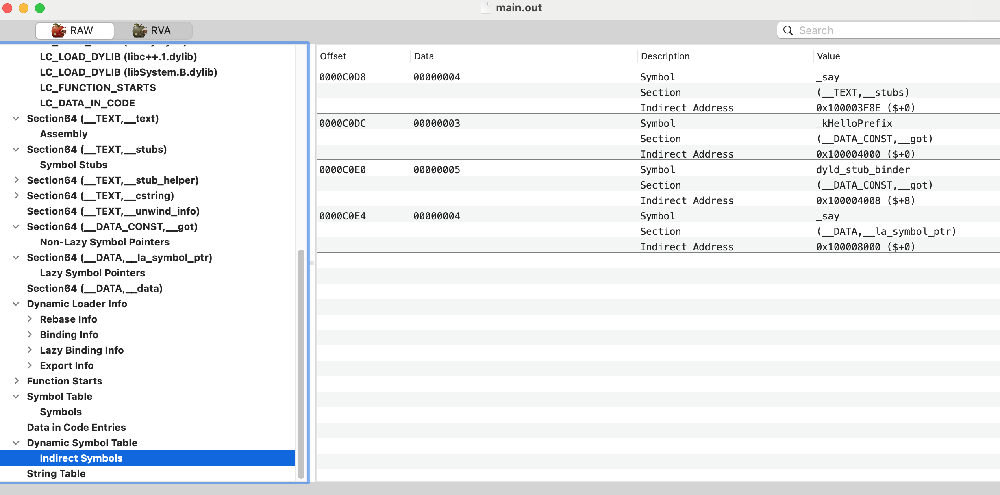

# MachO 文件概览
.o文件，动态库，可执行文件 都是MachO文件类型。

## MachO 文件的组成
由Header，Load Command，Section，Symbol Table，Dynamic Symbol Table等组成。

### MachO Header
```
struct mach_header_64 {
    uint32_t magic;           /* mach magic number identifier */
    cpu_type_t cputype;       /* cpu specifier */
    cpu_subtype_t cpusubtype; /* machine specifier */
    uint32_t filetype;        /* type of file */
    uint32_t ncmds;           /* number of load commands */
    uint32_t sizeofcmds;      /* the size of all the load commands */
    uint32_t flags;           /* flags */
    uint32_t reserved;        /* reserved */
};
```
- magic number: 一个16进制常数，用于标识是大端还是小端模式(另外的说法是标识是32位还是64位)
- cputype 和 cpusubtype: cpu类型
- filetype: 常用的有：目标文件，可执行文件，动态库，静态库,动态链接器
- ncmds: Load Command 的个数
- sizeofcmds: Load Command 的容量
- flags: 动态链接器的标识

### MachO Load Command
用于描述程序如何被加载，包含程序头表(Segment)以及Segment下各Section Header,以及依赖的动态库

直观看下：


以LC_Segment_64(__TEXT)为例，它描述了程序从哪里来(File Offset/Size)，到哪里去(VM Address/Size)，以及Section Header的个数，以及这个Segment的访问权限。

对应的数据结构:
```
struct segment_command_64 { /* for 64-bit architectures */
    uint32_t   cmd;         /* LC_SEGMENT_64 */
    uint32_t   cmdsize;     /* includes sizeof section_64 structs */
    char       segname[16]; /* segment name */
    uint64_t   vmaddr;      /* memory address of this segment */
    uint64_t   vmsize;      /* memory size of this segment */
    uint64_t   fileoff;     /* file offset of this segment */
    uint64_t   filesize;    /* amount to map from the file */
    vm_prot_t  maxprot;     /* maximum VM protection */
    vm_prot_t  initprot;    /* initial VM protection */
    uint32_t   nsects;      /* number of sections in segment */
    uint32_t   flags;       /* flags */
};
```

### MachO Section
即各Section的内容

### Symbol Table
程序的符号表，含有所有的符号，包括动态链接的符号

### Dynamic Symbol Table
是一个索引数据，它存储的动态链接的符号，在Symbol Table中的位置。

如上图，第一项的值是4，则_say这个符号，在Symbol Table中的索引就是4.

### 常见Segment
几乎所有的MachO都都包含以下三个Segment:
- __TEXT Segment: 包含**Mach Header，Load Command**，以及__TEXT,__text等section。权限是r-x
- __DATA Segment:存储全局变量和静态变量。权限时rw-
- __LINKEDIT Segment:包含了加载程序的原数据，如函数的名称和地址; 每个MachO的页面都有自己的哈希，在mmap Page-In的时候需要校验哈希，而这些哈希正是存储在__LINKEDIT中；权限r-

关于__TEXT Segment 包含Mach Header，Load Command的论证，从`LC_Segment_64(__TEXT)`可以看到Segment在文件中的范围是0~16383，共16384个字节，换算成16进制就是0x4000,查看__DATA Segment 


Segment划分的直观展示：


当MachO镜像被多个进程加载时，__TEXT和__LINKEDIT因为是只读的，可以被共享；而__DATA则是每个进程存在一个副本；当dyld执行结束之后，__LINKEDIT就没有用了，对应的内存页会被回收。

## 动态链接
可执行文件对动态库符号的引用，要么执行__got，要么指向__stubs.
__got：存储的是数据型符号的地址，在加载时绑定，是non-lazy的;因为数据部门会存在绝对地址引用，无法做到地址无关，且动态库的__DATA 是每个进程单独用户的。
__stubs:用户函数符号的绑定，在符号第一次被使用(运行)时绑定，是lazy binding的。

### 动态库全局数据符号的绑定
动态库装载之后在Binding前，__got里所有条目都是0，dyld会对__got中每个符号进行重定位将其地址写入。

### 动态库全局函数符号的绑定
.text对函数的调用，先到.stub -> __la_symbol_ptr -> ... ->动态链接器找到地址填入。

以首次访问 NSLog 为例：
1. NSLog 对应的 __la_symbol_ptr 条目内容指向到 __stub_helper。
2. __stub_helper 里的代码逻辑，通过各种辗转最终调用 dyld_stub_binder 函数。
3. dyld_stub_binder 函数通过调用 dyld 内部的函数找到 NSLog 符号的真实地址。
4. dyld_stub_binder 将地址写入 __la_symbol_ptr 对应函数中。
5. dyld_stub_binder 跳转到 NSLog 符号的真实地址。
6. 之后再次访问 NSLog 时，跳转到 __la_symbol_ptr 段后直接跳转符号的真实地址。


__la_symbol_ptr 中的所有项都指向了 __stub_helper 中的一段汇编指令

所有引用的外部函数最终都会跳转到 dyld_stub_binder，这是一个寻找外部函数地址的函数，Lazy binding symbol 的绑定工作正是由 dyld_stub_binder 触发，必须提前绑定好，所以它和常量和全局变量放在了一个段。

### 其他
1.mmap：把文件某个片段映射到进程逻辑内存的某个页上

2.Copy-On-Write： __DATA 段是可读写的。这里使用到了 Copy-On-Write 技术，简称 COW。目的是**多个进程共享一页内存空间时，一旦有进程要做写操作，它会先将这页内存内容复制一份出来，然后重新映射逻辑地址到新的 RAM 页上**。也就是这个进程自己拥有了那页内存的拷贝。这就涉及到了 clean/dirty page 的概念。dirty page 含有进程自己的信息，而 clean page 可以被内核重新生成（重新读磁盘）。所以 dirty page 的代价大于 clean page。

3.image: 即MachO文件的镜像

4.pagezero: 虚拟地址空间最开始的一段空间，不可读、不可执行、不可写，用来捕获空指针和指针截断。在32位系统上是前4KB；在64位系统上是4GB。

参考文章：
https://zhangbuhuai.com/post/macho-dynamic-link.html#indirect-symbol-table
https://yulingtianxia.com/blog/2016/10/30/Optimizing-App-Startup-Time/

## 实践

### 区分动态库，静态库
1.通过命令行
```
//动态库
file MyFrameWork
MyFrameWork: Mach-O universal binary with 2 architectures: [x86_64:Mach-O 64-bit dynamically linked shared library x86_64] [arm64:Mach-O 64-bit dynamically linked shared library arm64]
MyFrameWork (for architecture x86_64):	Mach-O 64-bit dynamically linked shared library x86_64
MyFrameWork (for architecture arm64):	Mach-O 64-bit dynamically linked shared library arm64

//静态库
file MyFrameWork
MyFrameWork: Mach-O universal binary with 2 architectures: [x86_64:current ar archive random library] [arm64:current ar archive random library]
MyFrameWork (for architecture x86_64):	current ar archive random library
MyFrameWork (for architecture arm64):	current ar archive random library
```

2.通过MachOView 查看静态库是.o文件的归档，而动态库是一个类似可执行文件的存在。

3.制作的时候，可以XCode选择MachO Type来区分

### Embed framework
将你的动态库copy 到app的frameworks文件夹下，否则会报`libray not found`的错误

- 对于 系统动态库，可以将 Embed 属性设置成 Do Not Embed，因为 iOS 系统提供了相关的库，我们无需将它们再嵌入到应用程序的 ipa 包中，如：Foundation.framework、UIKit.framework。
- 对于 用户动态库，需要将 Embed 属性设置成 Embed，因为链接发生在运行时，链接器需要从应用程序的 ipa 包中加载完整的动态库。
- 对于 静态库，需要将 Embed 属性设置成 Do Not Embed，因为链接发生在编译时，编译完成后相关代码都已经包含在了应用程序的可执行文件中了，无需在应用程序的 bundle 中再保存一份。

### `use_frameworks!`与`use_modular_headers!`
为什么使用`use_frameworks!`？ 因为XCode9之前不支持swift静态库编译，因此swift pod不得不采用动态库编译，即使用`use_frameworks!`。

`use_modular_headers!`的作用：
1.简化 Swift 引用 OC 的方式，不需要再经过 bridging-header 进行桥接。
2.强制使用更优的模块导入方式`#import <NameSpace/fileName.h> `, 不能在使用`#import "fileName.h"`

## MachO安全

### ASLR
将动态库加载的随机的地址上，避免攻击者跳转到指定地址恶意破坏程序

因为加载地址随机，所以在pre-main阶段又dyld修复这些偏移 slide

### Code Sign
1.MachO 每一页都有它的哈希，哈希被存储在__LINKEDIT中
2.在Page-In的时候，哈希会被验证


