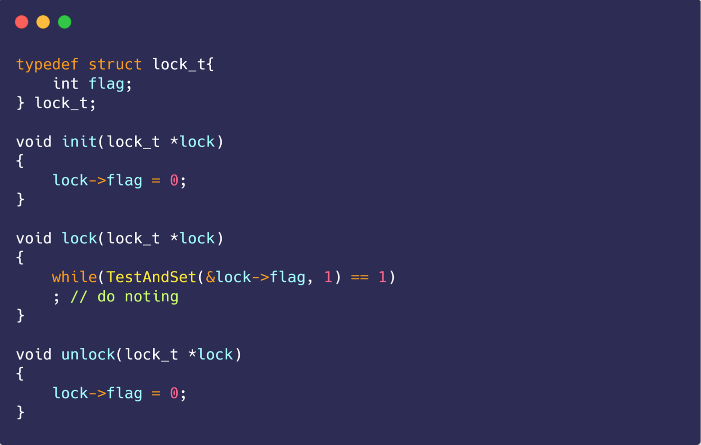
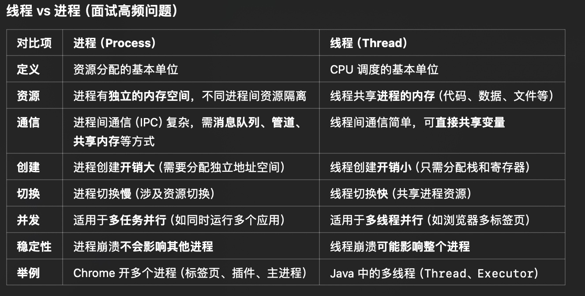

iOS 多线程
# 1 iOS中的锁

## 1.1 锁的分类
- 自旋锁。如OSSpinLock，没有获取到锁的时候，处于busy-waiting的装态；自旋锁不会让出时间片，从而一直占用CPU资源
- 互斥锁。如pthread_mutex，没有获取到锁的时候，处于休眠状态；互斥锁会让出时间片。

1.同等水平下自选锁和互斥锁的选择？
自旋锁避免了线程上下文切换的耗时，如果临界区小，适合使用自旋锁，反之适用互斥锁

2.一些数据参考
一般线程获取到时间片在10-40毫秒大小(存疑，但确实是这个数量级)
单次线程上下文切换的耗时：10微秒左右

3.上下文切换都干了啥？
寄存器保存和加载，系统线程调度器代码需求执行，TLB实例需要重新加载，CPU的pipline需要刷新

## 1.2 锁的性能

参考YYKit作者的计算结果：

[计算代码](https://github.com/ibireme/tmp/blob/master/iOSLockBenckmark/iOSLockBenckmark/ViewController.m)

1.衡量标准：一千万次下，不同锁加解密耗时
2.性能排序
- OSSpinLock （自旋锁）
- dispatch_semphore
- pthread_mutex （互斥锁）
- 基于pthread_mutex的OC封装，如NSLock
- @sychronized

3.针对性能排序的分析：
3.1 选择锁时，并不能单独看以上数据，应结合临界区大小，比如临界区耗时长的，使用互斥锁就比自选锁要好

3.2 串行队列也是一种方案，但是性能不佳，约等同于@sychronized。实验数据：
一千万次加解锁耗时在 ms 级别的差异
```
OSSpinLock:                 111.07 ms
dispatch_semaphore:         160.90 ms
pthread_mutex:              215.16 ms
NSCondition:                221.99 ms
NSLock:                     225.93 ms
pthread_mutex(recursive):   387.72 ms
NSRecursiveLock:            442.67 ms
NSConditionLock:            723.82 ms
@synchronized:             1065.51 ms
serialqueue:                   1126.83 ms
---- fin (10000000) ----
```

##  1.3不同锁的实现概述
### 1.3.1 自旋锁
自旋锁的实现，依赖原子性的`test_and_set`的操作，所谓原子原子性即是不可不分割执行的一段代码，要么都执行，要么都不执行，它避免了多线程访问时出错的问题。

#### test_and_set的实现
设置新值，返回旧值
```
int TestAndSet (int *old_ptr, int new){
    int old = *old_ptr;
    *old_ptr = new;
    return old;
}
```

自旋锁的实现

while 循环中`TestAndSet`操作置1，并判断是否等于1. 只有在第一个线程可以跳过，其他线程一直等待。

让出时间片的操作：IO操作，时间片用完，进入睡眠装载。
像这种while 循环不会让出时间片，如果临界区过长，使用自旋锁不是一个好的选择。

### 1.3.2 信号量
1.wait操作
```
int sem_wait (sem_t *sem) {
  int *futex = (int *) sem;
  if (atomic_decrement_if_positive (futex) > 0)
    return 0;
  int err = lll_futex_wait (futex, 0);
    return -1;
)
```
dispatch_semphore_wait最终会调用到sem_wait.
- 原子性的减一
- 如果值大于0，则不用等待，继续向下执行
- 如果小于0，调用lll_futex_wait，lll是low level lock的简称。这个函数用汇编实现，并通过SYS_futex系统调用，**使线程进入睡眠状态，主动让出时间片进入休眠装载**。
2.signal操作
```
long dispatch_semaphore_signal(dispatch_semaphore_t dsema) {
	long value = dispatch_atomic_inc2o(dsema, dsema_value);
	if (fastpath(value > 0)) {
		return 0;
	}
	return _dispatch_semaphore_signal_slow(dsema);
}

```
signal不需要阻塞，只用唤醒
- 首先调用原子方法，让value加一，如果大于0，就立刻返回。
- 否则调用内核的` semaphore_signal1 函数唤醒信号量，然后返回 1

### 1.3.3 pthread_mutex
互斥锁在不同平台上实现不同，在有的平台上是借用信号量实。而互斥锁可以设置类型，使之成为条件锁、递归锁等，因此在加解锁的时候多了一些判断，因此性能不如信号量是正常的。

### 1.3.4 NSRecursiveLock(递归锁)
NSRecursiveLock 也是借用pthread_mutex来实现，在函数内部会判断锁的类型，如果是递归锁，仅仅是引用计数加一，锁的释放也是同理
```
#include <stdint.h>
#include <pthread.h>
Class MyRecursiveLock
{
public:
  MyRecursiveLock()
  {
    lock_holder_ = NULL;
    hold_counter_ = 0; //注意这里的count 应该是和当前线程绑定的，而不能使用全局变量。简单的就用tls做中转就行
    pthread_mutex_init(&lock_, NULL);
  }
  int lock()
  {
    int ret = 0;
    pthread_t curr_id = pthread_self();
    if (lock_holder_ == curr_id) {
      ++hold_counter_;
    } else {
      pthread_mutex_lock(&lock_);
      lock_holder_ = curr_id;
      hold_counter_ = 1;
    }
    return ret;
  }
  int unlock()
  {
    int ret = 0;
    pthread_t curr_id = pthread_self();
    //应该由加锁的线程来解锁，如果不相等即是不同的线程，是异常情况
    if (lock_holder_ != curr_id) {
      ret = -1;
    } else {
      if (--hold_counter_ == 0) {
        lock_holder_ = NULL;
        pthread_mutex_unlock(&lock_);
      }
    }
    return ret;
  }
private:
  pthread_mutex_t lock_;
  pthread_t lock_holder_;
  int64_t hold_counter_;
};
```

参考文章：
https://github.com/bestswifter/blog/blob/master/articles/ios-lock.md
https://chonghw.github.io/blog/2016/07/11/recursivemutex/

# 2 多线程方案
## 2.1常用的多线程方案
- pthread： C语言实现，跨平台
- NSThread：pthread的OC封装，-需要自己管理线程的生命周期
- GCD: C 语言实现，不需要关注线程，只需要设置好队列和同步异步即可；由一些编译优化，如fastpath何slowpath，优化了CPU执行分支语句的效率；会根据操作系统的状态，决定是否创建新的线程
- NSOperation 和 NSOperationQueue：NSOperationQueue是GCD的OC封装，更加面向对象，功能更强大
- async/await中的会使用协同式线程池，创建<= core个数的线程 用来执行任务

在当前苹果以不推荐使用NSThread来进行多线程编程，具体参考：[ThreadMigration](https://developer.apple.com/library/archive/documentation/General/Conceptual/ConcurrencyProgrammingGuide/ThreadMigration/ThreadMigration.html)

## 2.2 GCD和NSOperationQueue的对比
1. 需要明确的是：NSOperationQueue 是GCD的OC封装
2. GCD是C语言风格的API，更接近底层性能更高，使用更方便，只用考虑同步异步，串行并行即可。
3. NSOperationQueue 功能更为强大，可以设置依赖关系、优先级、同时可以使用KVO观测任务的执行，如_executing、_finished的状态。当然GCD也可以实现这些，只是需要编写更多的代码
4. 像一个知名的库，如AF和SD，都使用了NSOperation，这也从侧面说明，在需要并发控制时，使用NSOperation是一个更好的选择。

参考文章：
https://wizardforcel.gitbooks.io/hit-alibaba-interview/content/source/iOS/Cocoa-Touch/Multithreading.html


# 3. 底层实现
## 3.1 dispatch_once 如何实现
### 早期版本
不同时期的gcd底层实现不同，早期版本底层会调用如下函数。注意这里的val即是外部传入的Static的onceToken
```
void dispatch_once_f(dispatch_once_t *val, void *ctxt, void (*func)(void *)){
    
    volatile long *vval = val;
    if (dispatch_atomic_cmpxchg(val, 0l, 1l)) {
        func(ctxt); // block真正执行
        dispatch_atomic_barrier();
        *val = ~0l;
    } 
    else 
    {
        do
        {
            _dispatch_hardware_pause();
        } while (*vval != ~0l);
        dispatch_atomic_barrier();
    }
}
```
前置知识：
`dispatch_atomic_cmpxchg`是一个宏定义，它调用的是`__sync_bool_compare_and_swap((p), (o), (n))`. 这是LockFree提供的一种原子操作，如果p和o相等就把n赋值给p，同时返回ture;否则返回false 不做任何处理。
dispatch_atomic_barrier：这是个内存屏障。CPU为了提供执行速度，可能会乱序执行，为了阻止这个现象，可以插入内存屏障，让它前后的代码只能顺序执行。在这里就是先执行dispatch_once中的block，在设置val的值。

1.多线程环境下，当执行到`dispatch_atomic_cmpxchg`时，只有第一个线程可以进入if循环，其他线程进入while 循环调用`_dispatch_hardware_pause`处于等待状态

2.当第一个执行执行完`dispatch_once`中的block ，将val 改为0，其他线程跳出while 循环，继续向下执行。

参考：http://lingyuncxb.com/2018/02/01/GCD%E6%BA%90%E7%A0%81%E5%88%86%E6%9E%902%20%E2%80%94%E2%80%94%20dispatch-once%E7%AF%87/

### 现在版本
```
void dispatch_once_f(dispatch_once_t *val, void *ctxt, dispatch_function_t func) {
	struct _dispatch_once_waiter_s * volatile *vval = (struct _dispatch_once_waiter_s**)val;
	struct _dispatch_once_waiter_s dow = { NULL, 0 };
	struct _dispatch_once_waiter_s *tail, *tmp;
	_dispatch_thread_semaphore_t sema;

	if (dispatch_atomic_cmpxchg(vval, NULL, &dow)) {
		_dispatch_client_callout(ctxt, func);
		tmp = dispatch_atomic_xchg(vval, DISPATCH_ONCE_DONE);
		tail = &dow;
		while (tail != tmp) {
			while (!tmp->dow_next) {
				_dispatch_hardware_pause();
			}
			sema = tmp->dow_sema;
			tmp = (struct _dispatch_once_waiter_s*)tmp->dow_next;
			_dispatch_thread_semaphore_signal(sema);
		}
	} else {
		dow.dow_sema = _dispatch_get_thread_semaphore();
		for (;;) {
			tmp = *vval;
			if (tmp == DISPATCH_ONCE_DONE) {
				break;
			}
			dispatch_atomic_store_barrier();
			if (dispatch_atomic_cmpxchg(vval, tmp, &dow)) {
				dow.dow_next = tmp;
				_dispatch_thread_semaphore_wait(dow.dow_sema);
			}
		}
		_dispatch_put_thread_semaphore(dow.dow_sema);
	}
}
```
使用原子性的CAS函数保证只有一个线程进入if分支。
1.第一个进入的线程onceToken为空，因此进入if分支执行block，执行之后将onceToken置位DISPATCH_ONCE_DONE。
2.同一个线程，再次进入的时候onceToken不为空，进入else分支的for 循环，由于onceToken就是DONE，因此不做任何事情直接跳出
3.如果是多个线程同时进入，只有第一个线程进入if分支，其他线程进入else分支的for循环；因为此时，onceToken还不是DONE，因此在循环中构建了一个链表，使用线程的信号量调用wait使线程睡眠；当if分支中block执行完成之后，则遍历链表的节点，依次调用signal方法唤醒线程。

参考：https://github.com/bestswifter/blog/blob/master/articles/objc-gcd.md

## 3.2 synchronized 如何实现
原理：它本质是语法糖，代码块的开始和结束分别调用`objc_sync_enter`和 `objc_sync_exit`；它使用递归锁(`os_unfair_recursive_lock`)。

### 数据结构分析：
它维护了一个8个(在ios上8个，mac 64个)元素的全局哈希表，哈希表中的每一个元素，是一个链表。
**不同对象的地址不同，但是通过上面的hash计算，最终都会落到0-7这个索引中，如果索引相同则插入到对应的链表中。**
大致结构如下：


哈希函数如下：
```
static unsigned int indexForPointer(const void *p) {
        uintptr_t addr = reinterpret_cast<uintptr_t>(p);
        return ((addr >> 4) ^ (addr >> 9)) % StripeCount;
    }
```

SyncData 结构
```
typedef struct alignas(CacheLineSize) SyncData {
    struct SyncData* nextData;
    DisguisedPtr<objc_object> object;
    int32_t threadCount;  // number of THREADS using this block
    recursive_mutex_t mutex;
} SyncData;
```
nextData: 构成链表的下一个元素
object： 即用来加锁的对象
threadCount： 使用这个元素加锁的线程个数
mutex： 用来加锁的对象,不同版本锁不一样 但应该都是递归锁，早期是os_unfair_recursive_lock。

### 加锁分析
锁对象的查找过程：这个过程本质是一个多级缓存的查找。先从tls查询两次，如果没有遍历链表，还没有则创建对象加入到链表

1. 先从tls中取出SyncData,判断它的object是否是synchronized的加锁对象，如果是的话，判断是加锁还是解锁，然后操作lockCount++ / lockCount--，然后存储到TLS中。注意当lockCount减为0的时候，会对threadCount减一

2. 上一步miss,从tls中取出SyncCache数组,它存储的当前线程使用synchronized加锁的所有数据，遍历数组匹配加锁对象，如果找到 所做的事和上一步一样。

3. 如果前面都没有找到，则从链表开始遍历，找到加锁的元素，将threadCount++;如果没有找到就创建一个SyncData插入到链表中。

4. 如果还是没有则创建对象，同时存储到tls中


补充1：查找的过程是为了获取SyncData的mutex，进行加锁和解锁

补充2：
```
typedef struct SyncCache {
    unsigned int allocated;
    unsigned int used;
    SyncCacheItem list[0];
} SyncCache;
```

### 锁的分析
这里面其实有两种锁。
1.SyncList的锁，这个锁的数量只有8个
```
struct SyncList {
    SyncData *data;
    spinlock_t lock;

    constexpr SyncList() : data(nil), lock(fork_unsafe_lock) { }
};
```
`SyncList`是表示`SyncData`的链表，它的锁用来保证在链表中查找枷锁对象是线程安全的。
这里的锁时`os_unfair_lock`

2.SyncData 是加锁对象的结构体包装，每一个解锁对象，都有一把锁，用于synchronized代码块中的加解锁。这里的锁是`os_unfair_recursive_lock`
```
int objc_sync_enter(id obj)
{
    int result = OBJC_SYNC_SUCCESS;

    if (obj) {
        SyncData* data = id2data(obj, ACQUIRE);
        assert(data);
        data->mutex.lock();
    } else {
        // @synchronized(nil) does nothing
        if (DebugNilSync) {
            _objc_inform("NIL SYNC DEBUG: @synchronized(nil); set a breakpoint on objc_sync_nil to debug");
        }
        objc_sync_nil();
    }

    return result;
}
```

### synchronized 传入nil 会发生什么
从上面源码中看到传入nil 会调用`objc_sync_nil`,而这是个空方法。这将使得你的代码不再是线程安全的

# 4.进程与线程
## 区别
概念上：
进程是运行中的程序实体，它是操作系统资源分配资源的基本单位。每个进程有自己的地址空间：以Segment划分，可以分为代码段、数据段、堆区、共享库区、栈区等；进程还管理着页表，它表示逻辑地址到物理地址的映射；进程也管理着VMA，它代表虚拟地址到可执行文件的映射
此外进程还管理打开的文件和IO设备

线程是进程中一段执行的流程，每个线程有自己的栈空间，iOS中主线程1MB，子线程512KB;除此之外线程共享进程的地址空间和管理的资源(如文件)。

重要区别：线程比进程轻量，创建、切换都更高效。

影响关系：一个进程崩溃后，在保护模式下不会对其他进程产生影响，但是一个线程崩溃整个进程都死掉。所以多进程要比多线程健壮。

执行过程: 每个独立的进程有程序运行的入口、顺序执行序列和程序出口。但是线程不能独立执行，必须依存在应用程序中

chatGPT 总结。根据它的分类，可以从定义、资源、创建等关键角度区分



## 进程切换与线程切换
线程切换：由于线程共享进程的地址空间(包括页表)和文件资源，在线程切换的时候，不需要经过内核，这样切换效率就更高了；由于线程是轻量级的，故只需要切换线程的栈空间和保存/恢复寄存器即可

简单记忆：线程切换 = 保存旧线程状态 + 选择新线程(执行线程调度) + 恢复新线程状态

进程切换：地址空间、寄存器、PC指针、页表

## 为什么要使用多线程
1.提升效率，充分利用多核cpu性能
2.线程的创建、销毁、切换等更快
3.同一进程内的线程共享进程的内存和资源，那么在线程之间切换的时候，不需要经过内核，这样效率就提升了

## 那么多线程会有什么缺点
1.每个线程需要分配一段内存空间，过多就溢出了
2.线程过多，切换耗时
3.需要考虑临界区，即线程不安全

# 5.题目
## 5.1 线程安全字典的实现
```
_ioQueue = dispatch_queue_create("ioQueue", DISPATCH_QUEUE_CONCURRENT);
- (void)setSafeObject:(id)object forKey:(NSString *)key
{
    key = [key copy];
    dispatch_barrier_async(self.ioQueue, ^{
        if (key && object) {
            [_dic setObject:object forKey:key];
        }
    });
}
- (id)getSafeObjectForKey:(NSString *)key
{
    __block id result = nil;
    dispatch_sync(self.ioQueue, ^{
        result = [_dic objectForKey:key];
    });
    return result;
}
```
参考：https://segmentfault.com/a/1190000002712678
1.为什么要自定义并发队列？
因为全局队列遇上栅栏函数 相当于普通的async，所以需要自定义。
2.为什么是并发的？
因为可以多线程读取
3.读操作，为什么使用sync? 
同步返回，避免等待。
4.写操作，为什么copy？
避免传入可变的字符串，外部可能在不经意间修改。导致无法取出值
5.读操作可以直接读取，不使用队列和sync函数吗？
单纯多线程读，其实不会出现线程安全问题；还是要使用队列的，这样保证队列中的写操作与其他操作隔离。因为队列若是发现接下来要执行的操作是个栅栏块，就会等待所有的并发块都执行完，才会单独执行这个栅栏块。

6.什么是dispatch_barrier_async函数？
barrier中任务是单独执行的，当队列中有barrier的任务，在它之前提交会先执行完才执行barrier；在它之后提交都要等待它执行完 才可以执行，实现类似于锁的作用。

即barrier中的任务是**互斥执行**的。


7.除此之外，还可以使用读写锁，pthread_rwlock来实现这个功能

## 5.2 atomic 的实现
objc runtime 属性设置方法`reallySetProperty`的实现
```
//slot为成员变量地址
id *slot = (id*) ((char*)self + offset);

if (!atomic) {
        oldValue = *slot;
        *slot = newValue;
    } else {
        spinlock_t& slotlock = PropertyLocks[slot];
        slotlock.lock();
        oldValue = *slot;
        *slot = newValue;        
        slotlock.unlock();
    }
```
以对象地址+成员变量的偏移为key，去PropertyLocks取出一个**os_unfair_lock（自旋锁，临界区这么小 使用互斥锁也不合理啊）**，对成员变量的访问进行加锁。

由于存取时，使用的时同一把锁，可以保证成员变量的读写是线程安全的。

注：PropertyLocks数量优先，iOS上8个，mac上64个，因此可能不同对象使用的也是同一把锁。那这样性能就降低了。

## 5.3 atomic 可以保证属性线程安全吗
两方面
- 如果是重写了setter 和 getter，那么你是享受不到atomic 的便利的
- 使用了atomic 只是保证了成员变量的读写是安全的，但是使用atomic描述数组，在多线程下读写数组仍然不安全。类似于 虽然block内无法修改外部变量,但还是可以拿到它的引用去做其他操作

```
    NSMutableString *str = [NSMutableString string];
    
    dispatch_after(dispatch_time(DISPATCH_TIME_NOW, (int64_t)(5 * NSEC_PER_SEC)), dispatch_get_main_queue(), ^{
        [str appendString:@""];
        
    });
```


## 5.4 什么情况下回死锁
死锁是指：两(多)个线程互相持有对方所需的资源时，导致这些线程处于等待状态，无法继续执行

常见的：
1.OSSpinLock的优先级反转，低优先级的线程先拿到锁，此时高优先的线程处于忙等状态，而低优先级的线程缺少必要的资源去执行临界区代码导致死锁

2.串行队列中，继续以dispatch_sync的形式，往同一个串行队列中，添加任务

3.非递归锁，加锁之后，在同一个线程再次上锁。

## 5.5 NSOperationQueue中的maxConcurrentOperationCount默认值
-1，最大并发数，由NSOperationQueue根据系统状态动态确定

## 5.6 定时器方案NSTimer、CADisplayLink、dispatch_source_t 的优劣
1.NSTimer
优点：使用简单。
缺点：依赖runloop；潜在的循环引用；计时不准确(如runloop执行了一个连续性计算，那么timer的触发时间会被延后)

2.CADisplayLink 
frameInterval： 标识间隔多少帧调用一次selector方法，默认值是1，即每帧都调用一次
优点：依托与屏幕刷新频率，所以的计时是准确的
缺点：潜在的循环引用；设置间隔不方便，NSTimer可以直接设置，它需要通过设置frameInterval; 目前iOS也有了高刷，那么一个frameInterval的时间是否固定需要验证一下；如果执行回调的时间过长，会导致跳过若干次回调。

参考：https://www.jianshu.com/p/ef99c010fd02
3.dispatch_source_t
优点： 不受 runloop 的影响
缺点： 计时可能不准确，为什么呢？ 在挂起期间，产生的事件会积累起来，等到 resume 的时候会融合为一个事件发送。所以一般都是直接取消，在重新创建一个

## 5.7 自己创建的队列与系统创建的队列有什么不同？
系统创建的队列是我们自己创建队列的`target queue`，我们创建的队列中的任务，最终都是放到target queue中完成真正的执行。
- 自己创建的serial queue 的target queue是系统的主队列
- 自己创建的并发队列的target queue是系统的并发队列

举例：虽然是不同的串行队列，但仍然发生了死锁
```
dispatch_queue_t queue = dispatch_queue_create("com.bestswifter.queue", nil);
        dispatch_sync(queue, ^{
            NSLog(@"current thread = %@", [NSThread currentThread]);
            dispatch_sync(dispatch_get_main_queue(), ^{
                NSLog(@"current thread = %@", [NSThread currentThread]);
            });
        });
```

那么自己创建的队列还有什么用呢？
可以实现复杂任务之间的同步（不太理解）。dispatch_barrir_async 与 自己创建的并发队列，算是一个例子吧

## 5.8  内核线程和用户线程由什么区别
1.操作系统是不知道用户线程的存在，因为操作是以线程为单位调度，当不知道用户线程时，也就无法实现真正的并发，虽然进程内有多个用户线程，也只能在一个CPU核心上运行，无法充分利用多核特性；另外当一个用户线程阻塞时，操作系统会认为是进程阻塞了

2.用户线程的线程表在进程内，内核线程的线程表在内核中。所以操作系统可以调度内核线程，可以让多个内核线程运行在多个CPU上

3.从用户态到内核态的切换是有代价的，因此内核线程的切换比用户线程的切换代价大；内核线程表存在操作系统的表格空间或栈空间，因此内核线程数量有限、扩展性不如用户线程

内核线程和用户线程有多种映射关系，如1：1， N:1, M:N,在iOS上是一个用户线程对应一个内核线程，即是1：1的关系。

## 5.9 内核态和用户态
内核空间（Kernal Space），这个空间只有内核程序可以访问；
用户空间（User Space），这部分内存专门给应用程序使用。

用户态（User Mode）：应用程序运行的受限模式，不能直接访问硬件。
内核态（Kernel Mode）：操作系统运行的模式，具有最高权限，可直接访问硬件。

内核程序执行在内核态（Kernal Mode），用户程序执行在用户态（User Mode）。当发生系统调用时，用户态的程序发起系统调用。因为**系统调用中牵扯特权指令，用户态程序权限不足，因此会中断执行，也就是 Trap（Trap 是一种中断）。**

发生中断后，当前 CPU 执行的程序会中断，跳转到中断处理程序。内核程序开始执行，也就是开始处理系统调用。**内核处理完成后，主动触发 Trap，这样会再次发生中断，切换回用户态工作**。 

## 5.10 多线程问题
### 情景1
```
- (void)showMebug{
    Person *p = [Person new];
    for (int i = 0; i < 1000; i++) {
        dispatch_async(dispatch_get_global_queue(0, 0), ^{
            p.name = @"jack";
            p.test = [NSObject new];
        });
    }
}
```

上面代码会崩溃，原因：Person的实例变量_test 可能会多次释放
set方法的原理：释放旧值，保存新值.如下实例：
```
-(void)setTest:(NSObject*)test {
    if(test != _test){
        id old = _test;
        _test = [test retain] ;
        [old release];
    }
}
参考：https://stackoverflow.com/questions/21802069/explicit-getters-setters-for-properties-mrc
```
字符串"jack"存储在常量区，是一个个tagpoint对他调用release/reatain 是没有效果的。

存在多个线程，对oldValue多次release的情况，因此会造成崩溃


### 情景2
```
- (void)showMebug{
    NSMutableArray *array = [NSMutableArray array];
    for (int i = 0; i < 1000; i++) {
        dispatch_async(dispatch_get_global_queue(0, 0), ^{
            [array addObject: [Person new]];
        });
    }
}
```

数组不是线程安全的，当数组需要扩容的时候，如果两个线程同时执行到这一块的代码，可能会对里面的元素多次release


大致是这个思路啊，可能会多次调用free. 就会崩溃了.

## 5.11 swift struct一定是线程安全的吗？
```
struct Basket {
    var amount: Int = 0
}

var basket = Basket()

func threadSafetyForStruct1() {
    let queue = DispatchQueue(label: "threadSafety1", attributes: [.concurrent])
    queue.async {
        for age in 1...30 {
            basket.amount = age
        }
        print("basket.amount1:\(basket.amount)")
    }
}

func threadSafetyForStruct2() {
    let queue = DispatchQueue(label: "threadSafety2", attributes: [.concurrent])
    queue.async {
        for age in 31...60 {
            basket.amount = age
        }
        print("basket.amount2:\(basket.amount)")
    }
}

threadSafetyForStruct1()
threadSafetyForStruct2()

```

输出如下：
basket.amount1:53
basket.amount2:60

这种直接捕获的并不是线程安全的，只有值类型当做参数在多个线程传递时才是线程安全的。

>在未优化状态下值类型其实默认是在堆上分配的,只有当做参数传递时，编译器才会优化将值类型放到栈上，每个线程保留一份。

