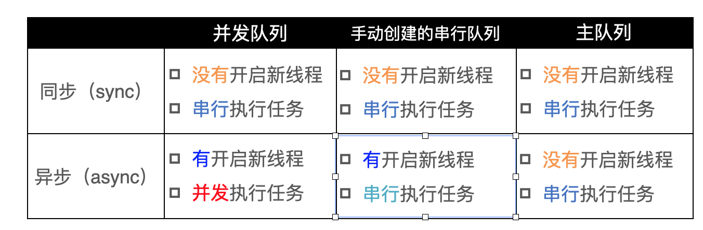

GCD的一些知识 or 源码总结
# 1.前置
## TSD
tsd: 同一个线程内不同函数间的数据访问机制，在不同的线程中，虽然他们的key相同，但是获取到的数据是不同的
## fastpath && slowpath
主要目的编译优化，提高CPU执行分支语句的效率
```
#define fastpath(x) ((typeof(x))__builtin_expect((long)(x), ~0l))
#define slowpath(x) ((typeof(x))__builtin_expect((long)(x), 0l))
```
fastpath(x): 依然返回x，只要告诉编译器x一般不会0，从而优化程序执行分支语句的效率；
slowpath(x): 依然返回x，只要告诉编译器x很可能0，从而优化程序执行分支语句的效率；

# 2.队列
GCD中的队列就是一个由结构体构成先进先出的队列，无论串行还是并行。
串行和并行的区别在于`dq_width`参数，串行是1，全局并发队列是UINT32_MAX。除此之外，队列还有其他参数，如`dq_running`: 表示队列是否空闲，0是空闲；`do_targetq`表示目标队列

# 3.开辟线程和什么有关
与队列无关；
`dispatch_sync`使用信号量阻塞当前线程的执行，等待任务执行；
从源码看`dispatch_async`中有开辟线程的逻辑，当线程池中无可用的线程中，会创建新的线程

dispatch_sync： 永远不会开启线程
dispatch_async:如果是主队列，则不会开启线程；如果是自定义的串行队列，或则并发队列，则会开启线程

需要说明的是：
**async+串行队列：即便多次执行，也只会开启一条线程。
async+并发队列：是会创建多个线程的**

# 4.Main Dispatch Queue唤醒主线程
**判断是否是主队列，如果是则会唤醒主线程。也即主队列的任务，只在主线程执行。**
```
void _dispatch_queue_wakeup_main(void)
{
    kern_return_t kr;
    
    // dispatch_once_f保证只初始化1次
    dispatch_once_f(&_dispatch_main_q_port_pred, NULL, _dispatch_main_q_port_init);
    
    // 唤醒主线程（核心逻辑在这里，可惜未开源）
    kr = _dispatch_send_wakeup_main_thread(main_q_port, 0);

    switch (kr) {
    case MACH_SEND_TIMEOUT:
    case MACH_SEND_TIMED_OUT:
    case MACH_SEND_INVALID_DEST:
        break;
    default:
        dispatch_assume_zero(kr);
        break;
    }

    _dispatch_safe_fork = false;
}
```

# 5. dispatch_sync
它将任务压入相应的队列，利用**线程专属信号量等待任务的执行**，保证了每次只有一个 block 被执行。因此dispatch_sync 是在当前线程执行的。

## 添加到串行队列
- 如果队列无其他任务，直接执行添加的任务
- 如果有其他任务，或者队列被挂起，等待任务完成，使用信号量通知当前线程继续执行
## 添加到并行队列
- 如果队列有其他任务、或者队列被挂起，则使用信号量等待任务完成
- 否则直接执行

其实核心逻辑是一样的。

无论何种情况，即自定义(串、并)队列、主队列、全局队列，内部都没有创建线程执行任务的逻辑，都是在当前线程阻塞执行。

# 6.dispatch_async

0.添加完任务，就立刻return了。取任务执行的逻辑在 _dispatch_wakeup 方法中

1.添加任务时，如果队列为空，则立刻唤醒队列执行任务。唤醒分主队列(`_dispatch_queue_wakeup_main`)和全局并发队列`_dispatch_queue_wakeup_global`，详情参看`_dispatch_wakeup`的原代码
如果是主队列，则去唤醒主线程执行任务。

如果是自己创建的串行队列，或是其他任务并发队列，唤醒过程中会根据内核的状态(`qc->dgq_thread_pool_size`)，即可用线程池的数量，来判断是否需要创建新的线程来执行任务。
- 如果是overcommit优先级的队列，workqueue则始终生成线程。
- 如果线程池中没有可用的线程，也会生成线程
- `#define MAX_THREAD_COUNT 255` 可见GCD内定义的线程最大数量是255

2.如果不为空，则插入到队列尾部。没有其他操作了
因为在队列执行wakeup之后，内部就一直在循环取任务执行。

3.队列中的**任务执行之后**，会等待65s，如果没有接受到信号量则释放线程；如果收到唤醒型号量，则继续执行。为什么是65s？大概是避免重复创建线程吧。同时这里的信号量正式前面唤醒队列发出的信号量

4._dispatch_worker_thread2
全局队列唤醒之后，最终都走到`_dispatch_worker_thread2`这个函数。它里面不停的从dispatch_queue中取出任务执行，如果没有任务就休眠
```
while ((item = fastpath(_dispatch_queue_concurrent_drain_one(dq)))) {
        // 用来对取出的内容进行处理(如果是任务，则执行任务)
        _dispatch_continuation_pop(item);
    }
```

5.关于async中并发队列 实现并发的
```
struct dispatch_object_s *
_dispatch_queue_concurrent_drain_one(dispatch_queue_t dq)
{
	struct dispatch_object_s *head, *next, *const mediator = (void *)~0ul;

	// The mediator value acts both as a "lock" and a signal
	head = dispatch_atomic_xchg(&dq->dq_items_head, mediator);

	
	next = fastpath(head->do_next);
    
    //忽略前面的异常分支, 这里表示普适的情景: 有head且head.next 也有值
    //在取出head之后, 将队列的next 设置为下一个元素;
	dq->dq_items_head = next;
    //取出一个任务之后,立马就接着唤醒队列(不用等待任务执行),接着取任务
	_dispatch_queue_wakeup_global(dq);
out:
    //外部负责执行head中保存的任务
	return head;
}
```
取出任务，就接着取唤醒队列(接着取任务)，而不等任务执行

# 7.创建队列
```
if (attr == DISPATCH_QUEUE_CONCURRENT) {
       //并行队列设置dq_width为UINT32_MAX
        dq->dq_width = UINT32_MAX;
        if (!tq) {
           //默认targetq，优先级为DISPATCH_QUEUE_PRIORITY_DEFAULT
            tq = _dispatch_get_root_queue(0, false);
        }
    } else {
        if (!tq) {
           //默认targetq，优先级为DISPATCH_ROOT_QUEUE_IDX_DEFAULT_OVERCOMMIT_PRIORITY
            // Default target queue is overcommit!
            tq = _dispatch_get_root_queue(0, true);
        }
    }
    //设置自定义队列的目标队列，dq队列的任务会放到目标队列执行
    dq->do_targetq = tq;
```
以上参考：https://xiaozhuanlan.com/topic/7193856240
队列创建的时候，会设置target queue, 即队列中的任务 最终都是放到target queue中执行的。
>串行队列的target_queue是一个支持overcommit的全局队列，而全局队列的底层则是一个线程池。


# 8.barrier
Dispatch Barrier会确保队列中先于Barrier Block提交的任务都完成后再执行它，并且执行时队列不会同步执行其它任务，等Barrier Block执行完成后再开始执行其他任务

这个特性，可以用来实现线程安全的多读单写！

```
if ((long)dc->do_vtable & DISPATCH_OBJ_BARRIER_BIT) { //代表的意义是: 并发队列,且dc 要求是barrier执行的
                //barrier 且 执行数大于1 则跳转out
				if (dq->dq_running > 1) {
					goto out; //不执行 等待
				}
                //执行任务
				_dispatch_continuation_pop(dc);
				_dispatch_workitem_inc();
			}
```


参考：
https://github.com/bestswifter/blog/blob/master/articles/objc-gcd.md
https://xiaozhuanlan.com/topic/7193856240
https://www.dazhuanlan.com/zzuwangfeng/topics/1283497