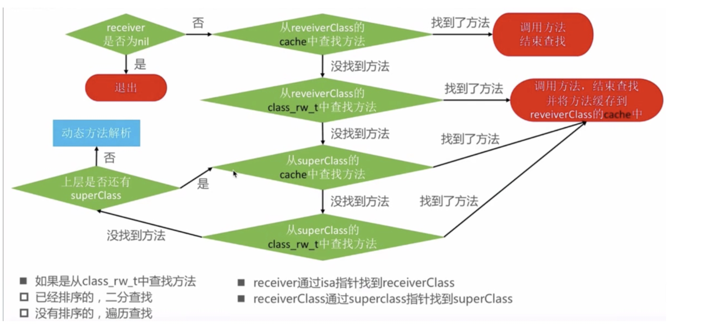
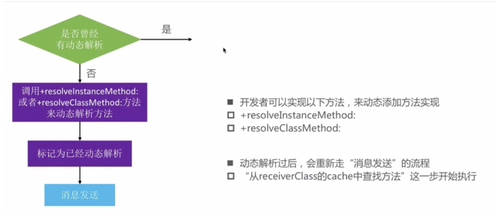
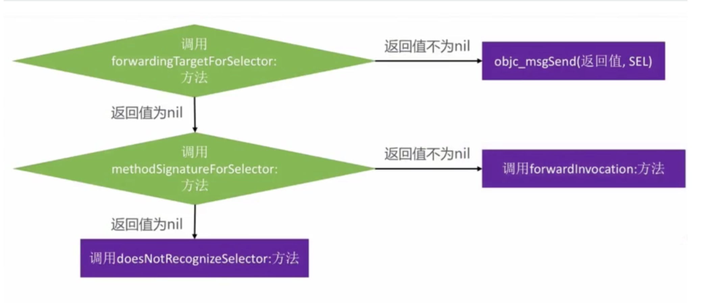
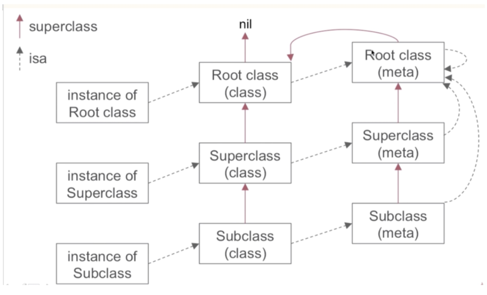
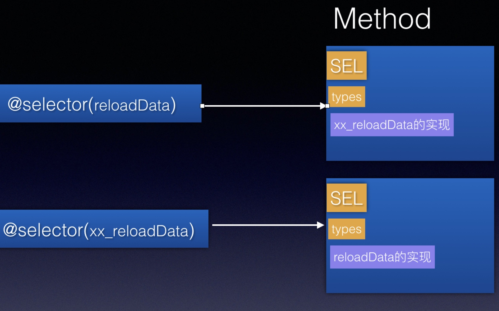

# iOS Runtime

## 1. alloc 分析
### alloc 流程
alloc  做了两个件事：
- 计算**实例变量**大小，并开辟空间
- 初始化isa指针
调用链：
```
+ (id)alloc {
    return _objc_rootAlloc(self);
}

id
_objc_rootAlloc(Class cls)
{
    return callAlloc(cls, false/*checkNil*/, true/*allocWithZone*/);
}

 bool dtor = cls->hasCxxDtor();
            id obj = (id)calloc(1, cls->bits.fastInstanceSize());
            if (slowpath(!obj)) return callBadAllocHandler(cls);
            obj->initInstanceIsa(cls, dtor);
            return obj;
            
//分配内存大小计算。取ro中实例变量大小，最终对象大小都>=16字节
size_t instanceSize(size_t extraBytes) {
    size_t size = alignedInstanceSize() + extraBytes;
    if (size < 16) size = 16;
    return size;
}

uint32_t alignedInstanceSize() {
    return word_align(unalignedInstanceSize());
}

uint32_t unalignedInstanceSize() {
    assert(isRealized());
    return data()->ro->instanceSize;
}

```

1.计算示例变量大小，注意是以16字节大小为单位进行内存对其
为什么是以16字节为单位呢？
提高内存访问效率，避免每次读取内存时，还要进行地址的计算
注意：此时打印obj只是一个内存地址`0x100726d00`，和我们平时打印的`<Person: 0x100726d00>`这种是不一样的，因此此时还没有将地址绑定到类上。

2.isa指针的初始化
```
inline void 
objc_object::initIsa(Class cls, bool nonpointer, bool hasCxxDtor) 
{ 
    assert(!isTaggedPointer()); 
    
    if (!nonpointer) {
        isa.cls = cls;
    } else {
        assert(!DisableNonpointerIsa);
        assert(!cls->instancesRequireRawIsa());

        isa_t newisa(0);

        newisa.bits = ISA_MAGIC_VALUE;
        // isa.magic is part of ISA_MAGIC_VALUE
        // isa.nonpointer is part of ISA_MAGIC_VALUE
        newisa.has_cxx_dtor = hasCxxDtor;
        newisa.shiftcls = (uintptr_t)cls >> 3;
        
        isa = newisa;
    }
}
```
初始化一个isa指针，将是否**有c++析构函数给它赋值**，将**类对象地址赋值给shiftcls**。

此时在打印obj对象，即可看到类型和地址了。

### init 方法
```
- (id)init {
    return _objc_rootInit(self);
}

id
_objc_rootInit(id obj)
{
    // In practice, it will be hard to rely on this function.
    // Many classes do not properly chain -init calls.
    return obj;
}
```
也仅仅是返回当前类的对象，不做其他的操作。
那为什还要有这个方法呢？
猜测是自定义初始化方法时，会调用super 的init方法，最终拿到一个当前类的对象。

### new 方法
```
+ (id)new {
    return [callAlloc(self, false/*checkNil*/) init];
}
```
new 先调用alloc，在调用init

## 2. 结构体内存对齐规则
对齐系数：结构体以其中内存最大的数据类型，作为对齐标准
- 规则1： 结构体的大小必定是对齐系数的整数倍，如果不够则填充
- 规则2： 结构体中前面变量所占大小要是后面变量所占大小的整数倍，如果不够则填充。
因为第二条规则的存在决定，如果结构体内变量的顺序不一样，则结构体所占内存可能也不一样。

举例1：
```
struct Child {
    int age; //4字节
    char sex; //1字节
    short height;// 2字节
}
```
分析规则2：
age 4字节，是sex 1字节的整数倍，满足条件不用填充
sex 1字节，不是 height 2字节的整数倍，不满足，需给sex 填充1字节。
分析规则1：
则 size = 4 + 2 + 2 = 8, 满足规则1 是对齐系数的整数倍，所以最终是8字节


举例2：同样是上面的结构体调整顺序
```
struct Child {
    char sex; //1字节
    int age; //4字节
    short height;// 2字节
}
```
分析规则2：
sex 不是age的整数倍，需要填充3字节，因此sex 实际占用4个字节；
age 是 height 的整数倍，不要填充。
分析规则1：
按照上面分析：size = 4 + 4 + 2 = 10 不是4的整数倍，因此需要给height填充2个字节
所以最终是12个字节

另外，除了上面的对齐规则外，还可用通过`#pragma pack(x)`来自定义对齐系数。
如#pragma pack(1)，指定按1字节对齐，则不用填充了。

**但是使用`#pragma pack(x)`会造成部分成员变量不对齐，不对齐在x86平台上影响效率，在其他平台上则会造成崩溃。所以最好不要用。**

参考：https://www.zhihu.com/question/27862634

补充基本数据类型，在32位和64位上的大小

|                | 32位 | 64位 |
|----------------|------|------|
| char           | 1    | 1    |
| short          | 2    | 2    |
| int            | 4    | 4    |
| float          | 4    | 4    |
| double         | 8    | 8    |
| long           | 4    | 8    |
| void *(即指针) | 4    | 8    |

即只有long 和 指针在32位和64位上大小不一样。

## 3.ISA 内容
在arm64位下是一个64位的共用体(所有成员公用一块内存,为了节省内存占用); 在32位系统中isa 仅指向类对象
 
```
 union isa_t {
     isa_t() { }
     isa_t(uintptr_t value) : bits(value) { }

     Class cls;
     uintptr_t bits;

     struct {
        uintptr_t indexed           : 1; //1表示为优化后的isa指针
        uintptr_t has_assoc         : 1; //有关联对象
        uintptr_t has_cxx_dtor      : 1; //有c++ 析构方法
        uintptr_t shiftcls          : 33; //33位 指向类对象
        uintptr_t magic             : 6; // 用来判断是否是真的初始化(即已经分配了空间)
        uintptr_t weakly_referenced : 1; //是否被弱引用过
        uintptr_t deallocating      : 1; //是否正在释放
        uintptr_t has_sidetable_rc  : 1; // 是否启用side table; 如对象引用技术太大,会启用
        uintptr_t extra_rc          : 19; //对象的引用计数值-1
     };
 };
```
 
 在对象alloc之后,设置的MAGIC_VALUE 会设置 indexed / magic 这两部分的值.
 即arm64下 isa 是一个共用体,表示了很多对象相关的信息

## 4.类对象的加载
1.对象的表示
```
 struct objc_object {
 private:
    //仅有一个isa指针
     isa_t isa;

 public:
    //都是一些方法
    ...
 }
 
``` 

 2.类对象的表示
 ```
 struct objc_class : objc_object {
     // Class ISA; //也有一个isa 指向它的元类
     Class superclass;
     cache_t cache;             // formerly cache pointer and vtable
    // rw 加 rr(retain/release等flag) / alloc
     class_data_bits_t bits;    // class_rw_t * plus custom rr/alloc flags
    
     class_rw_t *data() {
         return bits.data();
     }
 }
 ```
 
 3.类的加载
 ```
 //从machO加载类对象
 classref_t *classlist =
     _getObjc2NonlazyClassList(hi, &count);
 for (i = 0; i < count; i++) {
     Class cls = remapClass(classlist[i]);
     if (!cls) continue;

     
     addClassTableEntry(cls);

    
     realizeClassWithoutSwift(cls);
 }
 
 //realize
 static Class realizeClassWithoutSwift(Class cls)
 {
     runtimeLock.assertLocked();

     const class_ro_t *ro;
     class_rw_t *rw;
     Class supercls;
     Class metacls;
     bool isMeta;

     if (!cls) return nil;
     if (cls->isRealized()) return cls;
     assert(cls == remapClass(cls));

    //将rw 强制转换为 ro, 可以看到看到最开始类(编译后)的信息是存在rw中的
     ro = (const class_ro_t *)cls->data();
     if (ro->flags & RO_FUTURE) {
         // This was a future class. rw data is already allocated.
         rw = cls->data();
         ro = cls->data()->ro;
         cls->changeInfo(RW_REALIZED|RW_REALIZING, RW_FUTURE);
     } else {
         // Normal class. Allocate writeable class data.
        //重新分配rw内存
         rw = (class_rw_t *)calloc(sizeof(class_rw_t), 1);
        //设置ro引用
         rw->ro = ro;
         rw->flags = RW_REALIZED|RW_REALIZING;
         cls->setData(rw);
     }
 
    // Attach categories. 将category中的信息读取到rw中, 包括属性/方法/协议,但不包括实例变量
    methodizeClass(cls);
 
 }
 ```
 在将镜像映射到内存后，会读取每个镜像中的类：
 - 从MachO中读取数据
 - 类本身的数据 最开始在rw中，但是runtime初始化时，会重新设置：将rw强制转为ro,分配rw内存，rw->ro = ro; 
 - 读取分类数据，设置到rw上

## 5.消息机制
大体上分三步：
- 方法查找。从当前类对象和父类的 方法缓存和方法列表中查找
- 动态方法解析。即resolveInstanceMethod和resolveClassMethod,提供一个机会给当前对象添加方法，并**重走消息发送流程**
- 转发。将消息转发给其他对象








## 6.类的内省

### 理论
1.实例的class 方法返回类对象； 类的class方法返回自身。

注意这里类的class 是返回自身，而不是元类。为什么呢？
假如是元类，那么[[XXClass Class] classMethod],是调用不到类方法的。
元类的isa指向的对象中 没有classMethod，方法调用流程就做不到统一

```
//获取类对象 要调用object_getClass方法 从isa中去
- (Class)class {
//从isa中获取类对象
    return object_getClass(self);
}

//类方法， 返回自己. 那如何获取元类呢？+ [XXXClass Class] 肯定是不行的，要通过 object_getClass([XXXClass Class])
+ (Class)class {
    return self;
}
```

2.获取superClass, 结合上面【类对象的加载】，superClass指针在类对象中, 因此要先获取类对象 才能找到superClass
```
//已经是类对象，直接去superClass
+ (Class)superclass {
    return self->superclass;
}

//实例 要先获取类对象
- (Class)superclass {
    return [self class]->superclass;
}
```

3. 使用以下四个比较方法时，左边是实例 右边要是类对象；左边是类对象，右边要是元类

```
//左边是实例 
//对象是否是某个类的实例
- (BOOL)isMemberOfClass:(Class)cls {
    return [self class] == cls;
}

//对象 是某个类的子类/孙子类
- (BOOL)isKindOfClass:(Class)cls {
    for (Class tcls = [self class]; tcls; tcls = tcls->superclass) {
        if (tcls == cls) return YES;
    }
    return NO;
}

//左边是类对象
//以下两个方法，都是用 object_getClass((id)self)，即获取的都是元类
要想结果为true，传入的比较对象也必须是元类
+ (BOOL)isMemberOfClass:(Class)cls {
    return object_getClass((id)self) == cls;
}

+ (BOOL)isKindOfClass:(Class)cls {
    for (Class tcls = object_getClass((id)self); tcls; tcls = tcls->superclass) {
        if (tcls == cls) return YES;
    }
    return NO;
}
```

### 测试1：实例
```
Person *p = [[Person alloc]init];
        
NSLog(@"%d",[p isMemberOfClass:[Person class]]); 
NSLog(@"%d",[p isMemberOfClass:[NSObject class]]);
        
NSLog(@"%d",[p isKindOfClass:[Person class]]); 
NSLog(@"%d",[p isKindOfClass:[NSObject class]]); 
```

分析：
p 是Person的实例，不是NSObject的实例
p 是Person的实例，是NSObject的子类

因此结果是 1、0、1、1

### 测试2：类
```
NSLog(@"%d",[Person isMemberOfClass:[Person class]]); 
NSLog(@"%d",[Person isMemberOfClass:[NSObject class]]);
        
NSLog(@"%d",[Person isKindOfClass:[Person class]]); 
NSLog(@"%d",[Person isKindOfClass:[NSObject class]]); 
```

左边是类对象，右边要元类才能比较；而+[XX Class]返回的依然是类对象，因此前三个都是0

第四个：

isKindOfClass 底层先获取Person的元类，看它和右边是否相同；如果不同一直取元类的父类，而NSObject的元类的父类是NSObjcet类对象，因此是相等的

### 测试3： 方法调用
```
@interface NSObject (Sark)

+ (void)foo;

@end

@implementation NSObject (Sark)

- (void)foo {
    NSLog(@"IMP: -[NSObject (Sark) foo]");
}
@end

// 测试代码
[NSObject foo];
[[NSObject new] foo]; //显示没有问题
```
以上调用会是什么结果：Compile Error / Runtime Crash / NSLog…?

第一个执行过程：
NSObject meta -> superClass -> NSObject 类对象


### 继承链


isa: 实例的isa指向类对象；类对象的isa 指向元类。而**所有元类的isa指向NSObject的元类**
superclass: 类的superClass指向父类类对象；**类的元类的superClass指向父类的元类；NSObject元类的SuperClass指向 NSObject类对象**；**根类的类对象的superClass 指向 nil**


## 7. super
[super method]：
- super 只是编译器关键字，告诉编译器从父类开始进行方法查找，但是**消息的接受者还是self**
- 底层：objc_msgSendSuper((实例，父类)，sel);
```
struct objc_super {
    /// Specifies an instance of a class.
    //指定类的实例, 而不是父类
    __unsafe_unretained _Nonnull id receiver;

    /// Specifies the particular superclass of the instance to message. 
    //实例的父类,去查找消息
    __unsafe_unretained _Nonnull Class super_class;
};

传递一个当前类的对象去接受消息,并且从他的父类去查找方法

objc_msgSendSuper(struct objc_super * _Nonnull super, SEL _Nonnull op, ...)
```


继承：Student -> Person -> NSObject

```
//Student的init
- (instancetype)init{
    self = [super init];
    if (self) {
        NSLog(@"[self class] = %@",[self class]); //
        NSLog(@"[self superclass] = %@",[self superclass]);//
        
        NSLog(@"[super class] = %@",[super class]); //
        NSLog(@"[super superclass] = %@",[super superclass]);//
    }
    return self;
}
```
前两个分别是获取 self 的类对象和父类对象
后两个：从父类开始查找class 方法，但是receiver 任然是self. 而class方法定义在NSObjcet中，而接受对象还是self 因此和上面一样

结果是：
Student、Person、Student、Person

## 8.方法交换

交互的是Method中的IMP指针
```
struct method_t {
    SEL name;
    const char *types;
    MethodListIMP imp; //交换的是这个

    struct SortBySELAddress :
        public std::binary_function<const method_t&,
                                    const method_t&, bool>
    {
        bool operator() (const method_t& lhs,
                         const method_t& rhs)
        { return lhs.name < rhs.name; }
    };
};
```

## 9.KVO

```
- (void)addObserver:(NSObject *)observer forKeyPath:(NSString *)keyPath options:(NSKeyValueObservingOptions)options context:(nullable void *)context {
    
    //动态生成子类
    NSKVONotifying_XXX 继承自XXX , 用来代替self
    
    //重写XXX类中的被观察的方法，当值改变时 通知到观察着
    
    //重写XXX类的class方法 隐藏实现
    
    //重写XXX类的dealloc方法，对象释放时 异步动态创建的类

}
```


参考：
https://github.com/draveness/analyze/blob/master/contents/objc/%E5%AF%B9%E8%B1%A1%E6%98%AF%E5%A6%82%E4%BD%95%E5%88%9D%E5%A7%8B%E5%8C%96%E7%9A%84%EF%BC%88iOS%EF%BC%89.md

https://github.com/draveness/analyze/blob/master/contents/objc/%E4%BB%8E%20NSObject%20%E7%9A%84%E5%88%9D%E5%A7%8B%E5%8C%96%E4%BA%86%E8%A7%A3%20isa.md

https://github.com/draveness/analyze/blob/master/contents/objc/%E6%B7%B1%E5%85%A5%E8%A7%A3%E6%9E%90%20ObjC%20%E4%B8%AD%E6%96%B9%E6%B3%95%E7%9A%84%E7%BB%93%E6%9E%84.md