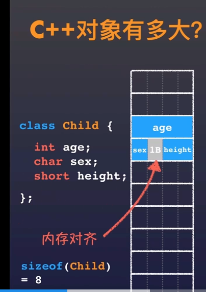

# iOS Runtime

## 1. alloc 分析
### alloc 流程
alloc  做了两个件事：
- 计算实例变量大小，并开辟空间
- 初始化isa指针
调用链：
```
+ (id)alloc {
    return _objc_rootAlloc(self);
}

id
_objc_rootAlloc(Class cls)
{
    return callAlloc(cls, false/*checkNil*/, true/*allocWithZone*/);
}

 bool dtor = cls->hasCxxDtor();
            id obj = (id)calloc(1, cls->bits.fastInstanceSize());
            if (slowpath(!obj)) return callBadAllocHandler(cls);
            obj->initInstanceIsa(cls, dtor);
            return obj;
```

1.计算示例变量大小，注意是以16字节大小为单位进行内存对其
为什么是以16字节为单位呢？
提高内存访问效率，避免每次读取内存时，还要进行地址的计算
注意：此时打印obj只是一个内存地址`0x100726d00`，和我们平时打印的`<Person: 0x100726d00>`这种是不一样的，因此此时还没有将地址绑定到类上。

2.isa指针的初始化
```
inline void 
objc_object::initIsa(Class cls, bool nonpointer, bool hasCxxDtor) 
{ 
    assert(!isTaggedPointer()); 
    
    if (!nonpointer) {
        isa.cls = cls;
    } else {
        assert(!DisableNonpointerIsa);
        assert(!cls->instancesRequireRawIsa());

        isa_t newisa(0);

        newisa.bits = ISA_MAGIC_VALUE;
        // isa.magic is part of ISA_MAGIC_VALUE
        // isa.nonpointer is part of ISA_MAGIC_VALUE
        newisa.has_cxx_dtor = hasCxxDtor;
        newisa.shiftcls = (uintptr_t)cls >> 3;
        
        isa = newisa;
    }
}
```
初始化一个isa指针，将是否有c++析构函数给它赋值，将类对象地址赋值给shiftcls。

此时在打印obj对象，即可看到类型和地址了。

### init 方法
```
- (id)init {
    return _objc_rootInit(self);
}

id
_objc_rootInit(id obj)
{
    // In practice, it will be hard to rely on this function.
    // Many classes do not properly chain -init calls.
    return obj;
}
```
也仅仅是返回当前类的对象，不做其他的操作。
那为什还要有这个方法呢？
猜测是自定义初始化方法时，会调用super 的init方法，最终拿到一个当前类的对象。

### new 方法
```
+ (id)new {
    return [callAlloc(self, false/*checkNil*/) init];
}
```
new 先调用alloc，在调用init

## 2. 结构体内存对齐规则
对齐系数：结构体以其中内存最大的数据类型，作为对齐标准
- 规则1： 结构体的大小必定是对齐系数的整数倍，如果不够则填充
- 规则2： 结构体中前面变量所占大小要是后面变量所占大小的整数倍，如果不够则填充。
因为第二条规则的存在决定，如果结构体内变量的顺序不一样，则结构体所占内存可能也不一样。

举例1：
```
struct Child {
    int age; //4字节
    char sex; //1字节
    short height;// 2字节
}
```
分析规则2：
age 4字节，是sex 1字节的整数倍，满足条件不用填充
sex 1字节，不是 height 2字节的整数倍，不满足，需给sex 填充1字节。
分析规则1：
则 size = 4 + 2 + 2 = 8, 满足规则1 是对齐系数的整数倍，所以最终是8字节


举例2：同样是上面的结构体调整顺序
```
struct Child {
    char sex; //1字节
    int age; //4字节
    short height;// 2字节
}
```
分析规则2：
sex 不是age的整数倍，需要填充3字节，因此sex 实际占用4个字节；
age 是 height 的整数倍，不要填充。
分析规则1：
按照上面分析：size = 4 + 4 + 2 = 10 不是4的整数倍，因此需要给age填充2个字节
所以最终是12个字节

另外，除了上面的对齐规则外，还可用通过`#pragma pack(x)`来自定义对齐系数。
如#pragma pack(1)，指定按1字节对齐，则不用填充了。

**但是使用`#pragma pack(x)`会造成部分成员变量不对齐，不对齐在x86平台上影响效率，在其他平台上则会造成崩溃。所以最好不要用。**

参考：https://www.zhihu.com/question/27862634

补充基本数据类型，在32位和64位上的大小

|                | 32位 | 64位 |
|----------------|------|------|
| char           | 1    | 1    |
| short          | 2    | 2    |
| int            | 4    | 4    |
| float          | 4    | 4    |
| double         | 8    | 8    |
| long           | 4    | 8    |
| void *(即指针) | 4    | 8    |

即只有long 和 指针在32位和64位上大小不一样。
