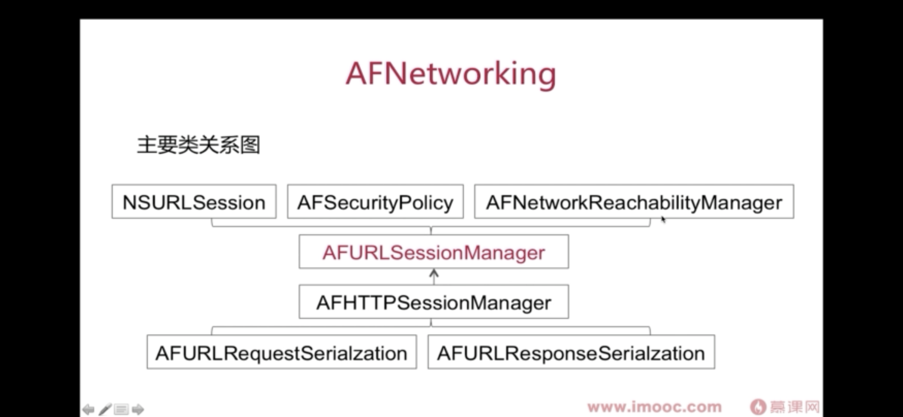

AFNetworking
# 层次结构



## 1. 核心类
AFURLSessionManager：核心类。负责请求的创建，URLSessionDelegate事件的分发，身份认证，调用请求和响应的序列化
AFHTTPSessionManager: 它是AFURLSessionManager的子类，封装了GET/POST等常用方法

### 1.1 创建请求
```
- (NSURLSession *)session {
    
    @synchronized (self) {
        if (!_session) {
            _session = [NSURLSession sessionWithConfiguration:self.sessionConfiguration delegate:self delegateQueue:self.operationQueue];
        }
    }
    return _session;
}
```
可以看到AF也是使用synchronized来防止线程竞争的。
delegateQueue：此处Apple要求必须是串行的，以保证URLSessionDelegate事件回调的顺序，所以在manager创建的时候同步创建并发为1的operationQueue

### 1.2 Delegate事件的分发
在创建dataTask的时候，会给当前task创建一个TaskDelegate对象，用来处理该请求的回调事件。
```
- (NSURLSessionDataTask *)dataTaskWithRequest:(NSURLRequest *)request
                               uploadProgress:(nullable void (^)(NSProgress *uploadProgress)) uploadProgressBlock
                             downloadProgress:(nullable void (^)(NSProgress *downloadProgress)) downloadProgressBlock
                            completionHandler:(nullable void (^)(NSURLResponse *response, id _Nullable responseObject,  NSError * _Nullable error))completionHandler {

    NSURLSessionDataTask *dataTask = [self.session dataTaskWithRequest:request];

    [self addDelegateForDataTask:dataTask uploadProgress:uploadProgressBlock downloadProgress:downloadProgressBlock completionHandler:completionHandler];

    return dataTask;
}

//创建TaskDelegate
- (void)addDelegateForDataTask:(NSURLSessionDataTask *)dataTask
                uploadProgress:(nullable void (^)(NSProgress *uploadProgress)) uploadProgressBlock
              downloadProgress:(nullable void (^)(NSProgress *downloadProgress)) downloadProgressBlock
             completionHandler:(void (^)(NSURLResponse *response, id responseObject, NSError *error))completionHandler
{
    AFURLSessionManagerTaskDelegate *delegate = [[AFURLSessionManagerTaskDelegate alloc] initWithTask:dataTask];
    delegate.manager = self;
    delegate.completionHandler = completionHandler;

    dataTask.taskDescription = self.taskDescriptionForSessionTasks;
    [self setDelegate:delegate forTask:dataTask];

    delegate.uploadProgressBlock = uploadProgressBlock;
    delegate.downloadProgressBlock = downloadProgressBlock;
}

//在设置Delegate的时候为了防止多线程操作出问题，使用了NSLock进行了加锁
- (void)setDelegate:(AFURLSessionManagerTaskDelegate *)delegate
            forTask:(NSURLSessionTask *)task
{
    NSParameterAssert(task);
    NSParameterAssert(delegate);

    //此处的lock是NSLock对象
    [self.lock lock];
    self.mutableTaskDelegatesKeyedByTaskIdentifier[@(task.taskIdentifier)] = delegate;
    [self addNotificationObserverForTask:task];
    [self.lock unlock];
}
```

### 1.3 TaskDelegate的作用
#### 处理请求进度
//类似的Delegate处理还有很多
```
- (void)URLSession:(__unused NSURLSession *)session
          dataTask:(__unused NSURLSessionDataTask *)dataTask
    didReceiveData:(NSData *)data
{
    self.downloadProgress.totalUnitCount = dataTask.countOfBytesExpectedToReceive;
    self.downloadProgress.completedUnitCount = dataTask.countOfBytesReceived;

    [self.mutableData appendData:data];
}
```

#### 请求结束时，处理错误/response序列化
```
- (void)URLSession:(__unused NSURLSession *)session
              task:(NSURLSessionTask *)task
didCompleteWithError:(NSError *)error {
    if (error) {
     //process error 
     //callback
    } else {
        dispatch_async(url_session_manager_processing_queue(), ^{
            NSError *serializationError = nil;
            //response 的序列化
            responseObject = [manager.responseSerializer responseObjectForResponse:task.response data:data error:&serializationError];
            dispatch_group_async(manager.completionGroup ?: url_session_manager_completion_group(), manager.completionQueue ?: dispatch_get_main_queue(), ^{
                if (self.completionHandler) {
                //回调
                    self.completionHandler(task.response, responseObject, serializationError);
                }
            });
        });
    }
}
```

#### 线程相关
1.设置串行队列，保证URLSessionDelegate是按序执行的
2.AF有设置url_session_manager_processing_queue的并发队列，去进行response的序列化
3.如果没有配置completionQueue，则在主队列回调请求的结果


## 2.请求序列化
主要是下面这个协议的实现
```
@protocol AFURLRequestSerialization <NSObject, NSSecureCoding, NSCopying>

- (nullable NSURLRequest *)requestBySerializingRequest:(NSURLRequest *)request
                               withParameters:(nullable id)parameters
                                        error:(NSError * _Nullable __autoreleasing *)error NS_SWIFT_NOTHROW;

@end
```
在框架中有三种实现：
- AFHTTPRequestSerializer： content-type:application/x-www-form-urlencoded, 以key1=val1&key2=val2 的形式编码。即表单的形式
- AFJSONRequestSerializer： 以json形式 编码body
- AFPropertyListRequestSerializer：以XML形式

需要说明的是：当参数在URL中时，如GET/HEAD/DELETE时，这几个类是不起作用的。
这序列化是针对请求参数放在body时，对其内容的编码方式。这个开发的时候，要和后端约定好

## 3.响应序列化：
```
@protocol AFURLResponseSerialization <NSObject, NSSecureCoding, NSCopying>

- (nullable id)responseObjectForResponse:(nullable NSURLResponse *)response
                           data:(nullable NSData *)data
                          error:(NSError * _Nullable __autoreleasing *)error NS_SWIFT_NOTHROW;

@end
```
同理，主要是对响应的序列化处理，在框架内有如下实现：
- AFHTTPResponseSerializer: 基类，用于验证数据是否合法
- AFJSONResponseSerializer：json形式
- AFXMLParserResponseSerializer：XML格式

## 4.证书校验
AFSecurityPolicy：支持公钥和证书全量校验，如果选none则使用操作系统内置的CA机构证书校验

## 5.网络状态
AFNetworkReachabilityManager


