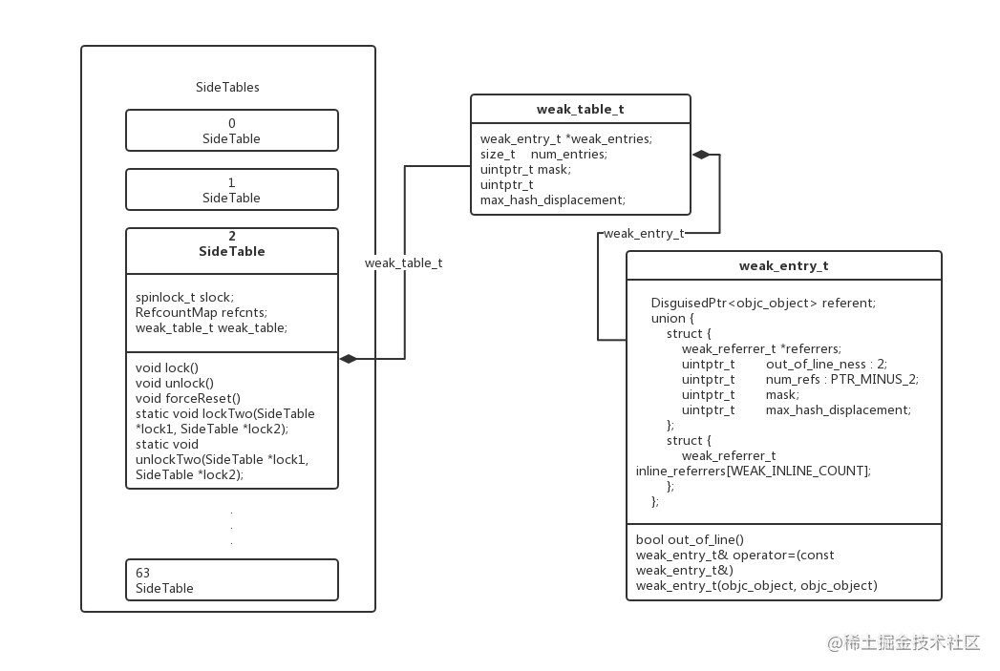

内存管理
# 1.weak 的实现原理
## 1.1weak指针的存储过程
1.以对象地址为key，从SideTables中取出SideTable. 
SideTable的定义
```
struct SideTable {
    spinlock_t slock; // 锁
    RefcountMap refcnts; // 引用计数表
    weak_table_t weak_table; //弱引用表，索引在SideTables中同一位置的对象的弱引用都是由这个table管理
}
```

SideTables在iOS平台是长度为8的数组，这样设计是为了分流，避免使用同一个哈希表。
因为SideTable中有一个自旋锁，如果都是用同一个SideTable，当对这个table进行操作的时候，其他类/线程都要等待，效率就很低

2.从weak_table中找到对应的weak_entry_t。

weak_table_t的定义如下，如官方注释，**它是一个全局的弱引用表，key是对象地址，value是weak_entry_t结构体**
```
/**
 * The global weak references table. Stores object ids as keys,
 * and weak_entry_t structs as their values.
 */
struct weak_table_t {
    weak_entry_t *weak_entries;
    size_t    num_entries;
    uintptr_t mask;
    uintptr_t max_hash_displacement;
};
```

**weak_entry_t的查找过程：很明显是一个哈希表查找+开放定址法解决哈希冲突的逻辑**
```
static weak_entry_t *
weak_entry_for_referent(weak_table_t *weak_table, objc_object *referent)
{
    assert(referent);

    weak_entry_t *weak_entries = weak_table->weak_entries;

    if (!weak_entries) return nil;

    size_t begin = hash_pointer(referent) & weak_table->mask;
    size_t index = begin;
    size_t hash_displacement = 0;
    while (weak_table->weak_entries[index].referent != referent) {
        index = (index+1) & weak_table->mask;
        if (index == begin) bad_weak_table(weak_table->weak_entries);
        hash_displacement++;
        if (hash_displacement > weak_table->max_hash_displacement) {
            return nil;
        }
    }
    
    return &weak_table->weak_entries[index];
}
```

3.向entry插入新的弱引用
```
weak_entry_t *entry;
    if ((entry = weak_entry_for_referent(weak_table, referent))) {
        append_referrer(entry, referrer);
    } 
    else {
        weak_entry_t new_entry(referent, referrer);
        weak_grow_maybe(weak_table);
        weak_entry_insert(weak_table, &new_entry);
    }
```
## 1.2weak指针置位nil的过程
1.按照存储的逻辑，依次从SideTables中找到SideTable，在利用SideTable的weak_table弱引用表找到对应的weak_entry_t, 然后将其中的指针置位nil
```
void 
weak_clear_no_lock(weak_table_t *weak_table, id referent_id) 
{
    objc_object *referent = (objc_object *)referent_id;

    weak_entry_t *entry = weak_entry_for_referent(weak_table, referent);
    if (entry == nil) {
        /// XXX shouldn't happen, but does with mismatched CF/objc
        //printf("XXX no entry for clear deallocating %p\n", referent);
        return;
    }

    // zero out references
    weak_referrer_t *referrers;
    size_t count;
    
    if (entry->out_of_line()) {
        referrers = entry->referrers;
        count = TABLE_SIZE(entry);
    } 
    else {
        referrers = entry->inline_referrers;
        count = WEAK_INLINE_COUNT;
    }
    
    for (size_t i = 0; i < count; ++i) {
        objc_object **referrer = referrers[i];
        if (referrer) {
            if (*referrer == referent) {
                *referrer = nil;
            }
            else if (*referrer) {
                _objc_inform("__weak variable at %p holds %p instead of %p. "
                             "This is probably incorrect use of "
                             "objc_storeWeak() and objc_loadWeak(). "
                             "Break on objc_weak_error to debug.\n", 
                             referrer, (void*)*referrer, (void*)referent);
                objc_weak_error();
            }
        }
    }
    
    weak_entry_remove(weak_table, entry);
}
```

2.将entry从weak_table中移除，即上面的weak_entry_remove函数
```
static void weak_entry_remove(weak_table_t *weak_table, weak_entry_t *entry)
{
    // remove entry
    if (entry->out_of_line()) free(entry->referrers);
    bzero(entry, sizeof(*entry));

    weak_table->num_entries--;

    weak_compact_maybe(weak_table);
}
```

## 1.3 数据结构


参考文章：https://juejin.cn/post/6844904101839372295

# 2.内存管理
- 针对NSNumber, NSDate 等采用TaggedPointer，在指针中存储数据
- 针对其他对象，采用引用计数的管理，具体可以使用strong/weak 等关键字描述

## 2.1 关于对象引用计数的存储
在64位之后，isa的每一位都存储了特定的信息：
extra_rc： 存储了引用计数值减一后的值
has_sidetable_rc：表示该对象引用计数值是否过大，当值过大的时候无法存储在isa指针中，需要使用**SideTable中的RefcountMap refcnts 引用计数表**来存储引用计数.

这个RefcountMap 也是一个哈希表，key是对象地址，value是队形引用计数值减一

验证以上逻辑，可以查看runtime中retainCount的实现
```
inline uintptr_t 
objc_object::rootRetainCount()
{
    assert(!UseGC);
    //如果是taggedPoint，则返回指针本身
    if (isTaggedPointer()) return (uintptr_t)this;

    sidetable_lock();
    isa_t bits = LoadExclusive(&isa.bits);
    //如果是64位的isa指针
    if (bits.indexed) {
        //先去extra_rc 中的值
        uintptr_t rc = 1 + bits.extra_rc;
        //在判断是否有外观sidetable
        if (bits.has_sidetable_rc) {
            rc += sidetable_getExtraRC_nolock();
        }
        sidetable_unlock();
        return rc;
    }

    sidetable_unlock();
    return sidetable_retainCount();
}

//sidetable
uintptr_t
objc_object::sidetable_retainCount()
{
    SideTable *table = SideTable::tableForPointer(this);

    size_t refcnt_result = 1;
    
    spinlock_lock(&table->slock);
    RefcountMap::iterator it = table->refcnts.find(this);
    if (it != table->refcnts.end()) {
        // this is valid for SIDE_TABLE_RC_PINNED too
        refcnt_result += it->second >> SIDE_TABLE_RC_SHIFT;
    }
    spinlock_unlock(&table->slock);
    return refcnt_result;
}
```

## 2.2 release操作
release操作的时候，会先判断当前retainCount是否为0，如果是则执行dealloc

http://yulingtianxia.com/blog/2015/12/06/The-Principle-of-Refenrence-Counting/
https://draveness.me/rr/


# 3. TaggedPoiner
对于64位程序，引入Tagged Pointer后，相关逻辑能**减少一半的内存占用，以及3倍的访问速度提升，100倍的创建、销毁速度提升**

假设我们要存储一个NSNumber对象，其值是一个整数。正常情况下，如果这个整数只是一个NSInteger的普通变量，那么它所占用的内存是与CPU的位数有关，在32位CPU下占4个字节，在64位CPU下是占8个字节的。而指针类型的大小通常也是与CPU位数相关，一个指针所占用的内存在32位CPU下为4个字节，在64位CPU下也是8个字节。如果没有Tagged Pointer对象，从32位机器迁移到64位机器中后，虽然逻辑没有任何变化，但这种NSNumber、NSDate一类的对象所占用的内存会翻倍

如何判断是否是taggedPoint?
判断标志位是否为1即可
```
static inline bool 
_objc_isTaggedPointer(const void * _Nullable ptr)
{
    return ((uintptr_t)ptr & _OBJC_TAG_MASK) == _OBJC_TAG_MASK;
}

```

https://muzico.gitee.io/niao/15450147544701.html