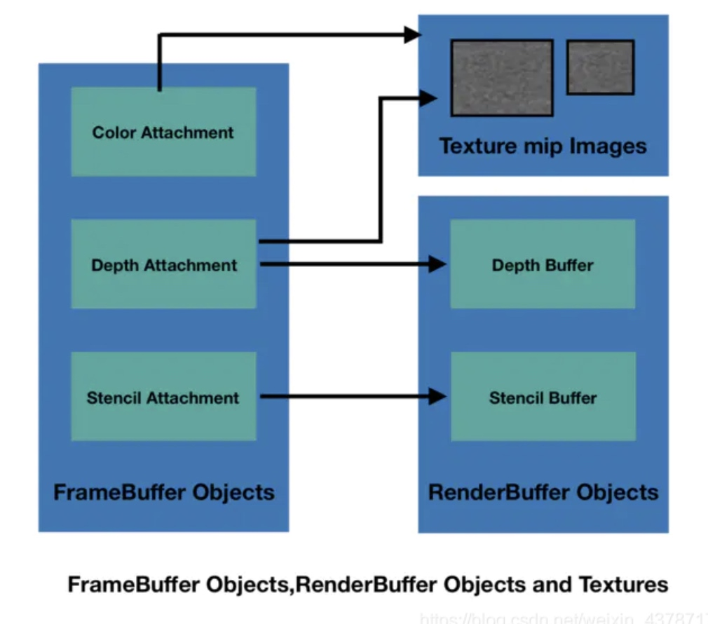

# 二、iOS平台上的OpenGL ES

## EAGLContext
由于iOS平台不允许直接操作surface，这也意味着在Apple平台上，不能通过eglSwapBuffers(交换两个缓冲区)来实现渲染结果在缓冲区的更新。
相应的iOS平台上有EAGLContext来替代标准OpenGL ES上的EGLContext。
Apple文档中说：
>An EAGLContext object manages an OpenGL ES rendering context—the state information, commands, and resources needed to draw using OpenGL ES. To execute OpenGL ES commands, you need a current rendering context.

即它的作用：
- GL的状态管理
- 渲染资源的管理，包括texture、renderbuffer
- buffer与context的绑定。`- renderbufferStorage:fromDrawable:`
- buffer内容的显示。`presentRenderbuffer:`

## CAEAGLLayer
如果要显示GL绘制的内容，必须要创建一个CAEAGLLayer对象，并将不透明设置为YES

## framebuffer 与 renderbuffer

framebuffer 是一个renderbuffer即它包含多种render buffer，renderbuffer并不是一个真正的缓冲区，它仅相当于C中的指针

renderbuffer有以下三种：
- Color：存储的是纹理图片颜色值，实质上纹理图片颜色值属于颜色附着点的一种
- Depth：深度缓冲区和颜色缓冲区
- Stencil：模版缓冲区

render buffer是真正的缓冲区，数据是在写在这里的

