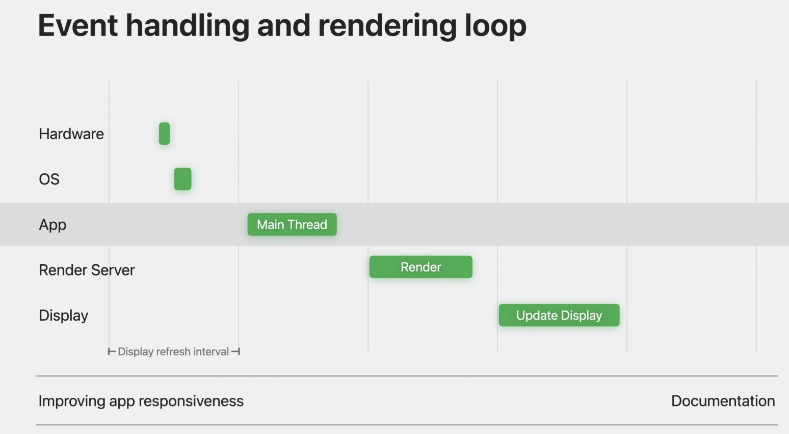
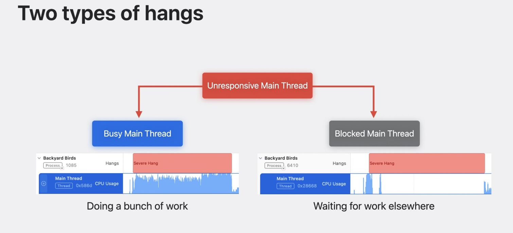
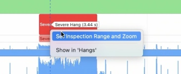
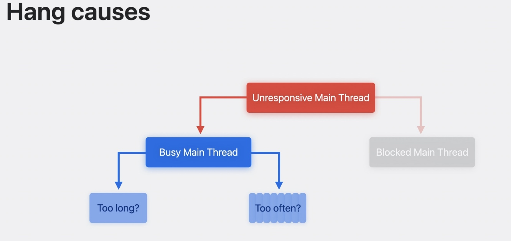
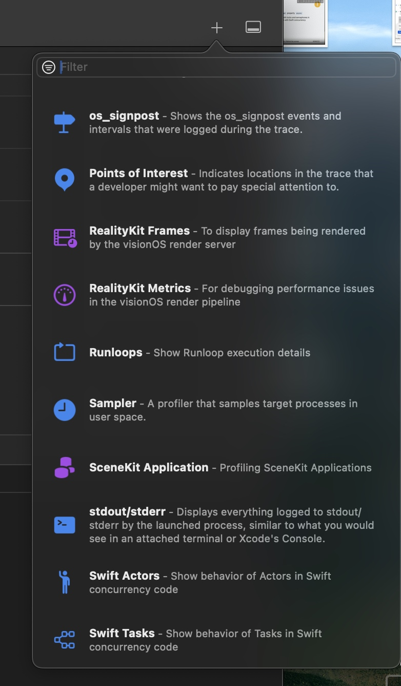
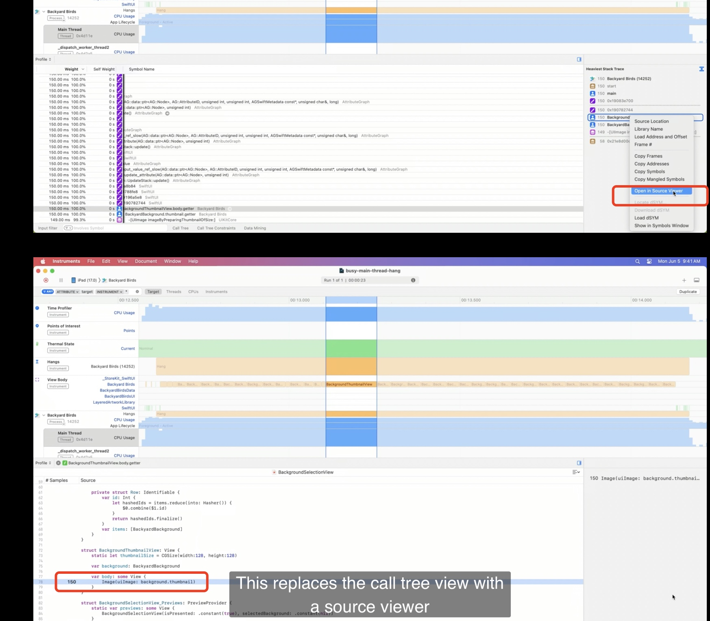
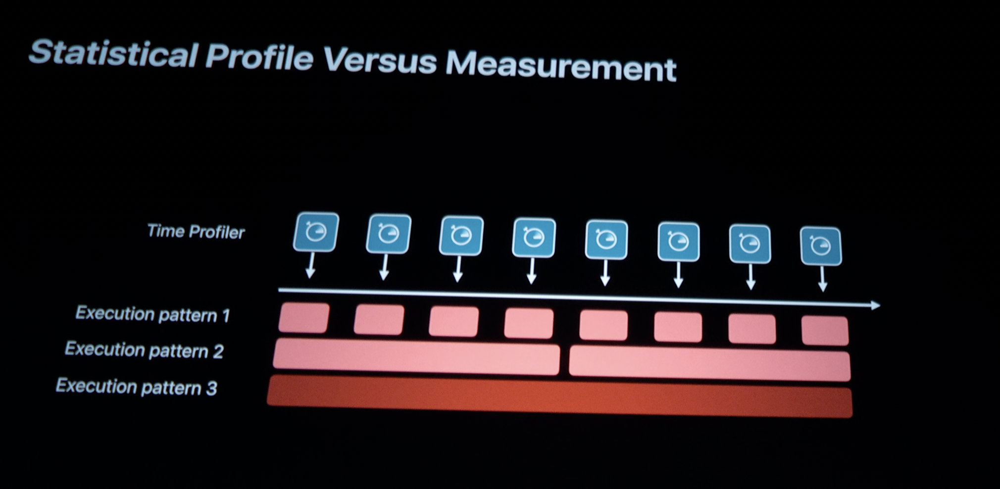
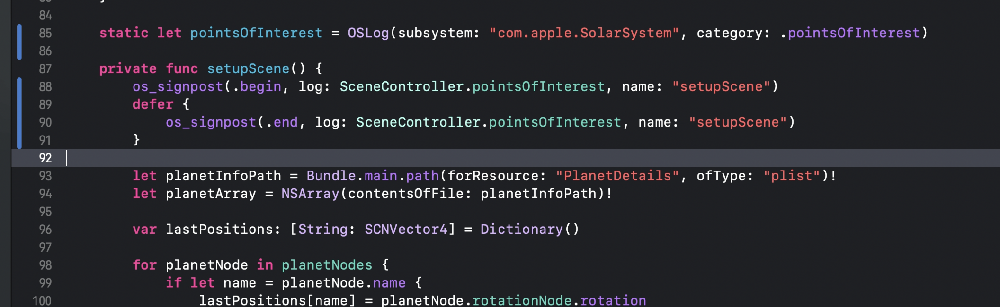
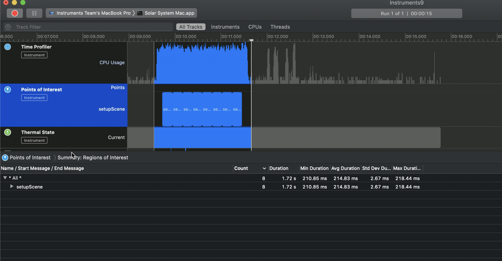
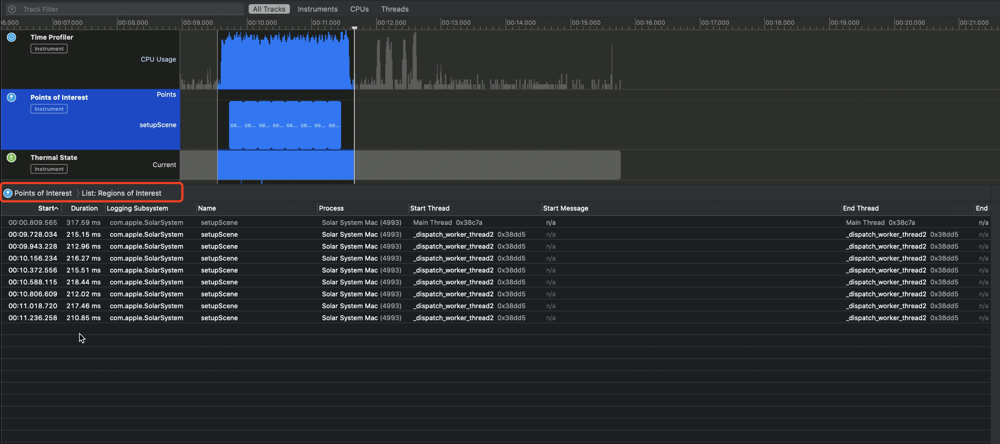

使用 Instruments 分析挂起

原文地址：https://wwdcnotes.com/documentation/wwdcnotes/wwdc23-10248-analyze-hangs-with-instruments/

# 挂起定义

- <100ms，意味着即时响应
- 100-250ms, 取决于敏感程度
- 250-500ms, microhangs
- 若>500, hangs

事件处理循环

# 挂起分类

- 主线程繁忙。可以看到主线程有一堆CPU活动
- 主线程被阻塞。主线程几乎无CPU活动，**通常是因为主线程要等待其他地方的任务完成，比如IO操作、锁、信号量**。

## 操作

单击挂起区域，点击option， 选择 set... 查看细节

## 主线程繁忙

- 执行了耗时任务
- 任务执行了太多次

不过profiler无法直接告诉我们是哪种情况，需要借助一些工具。
- 要测量特定函数的执行时间，请使用 os_signposts
- 针对SwiftUI可以使用 View Body

为什么呢？
因为time profiler是通过周期采样来判断是否卡顿，但是每次采样都是同一个方法时，它并不能判断出是因为执行时间长 还是执行了很多次。
实践中可以看代码逻辑区分出来。那如果是被阻塞，还是需要借助工具 来诊断的。

如何添加这些工具？
点击右上角加号。注意添加后 需要重新运行一次

看到单个任务的耗时

## 主线程被阻塞
点击右上角 【+】，添加 “thread state trace”工具。线程轨道将显示更详细的数据。

点击被阻塞的部分，下方将显示详细的信息。

## 其他
跳出main actor的方法
- Task.detached
- 标记为async ????

# 区分多次执行和一次执行耗时很长
Profiler 无法区别是哪种场景

在代码中插入 os_signpost

profile中显示

