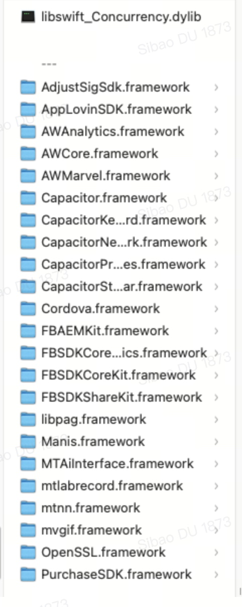
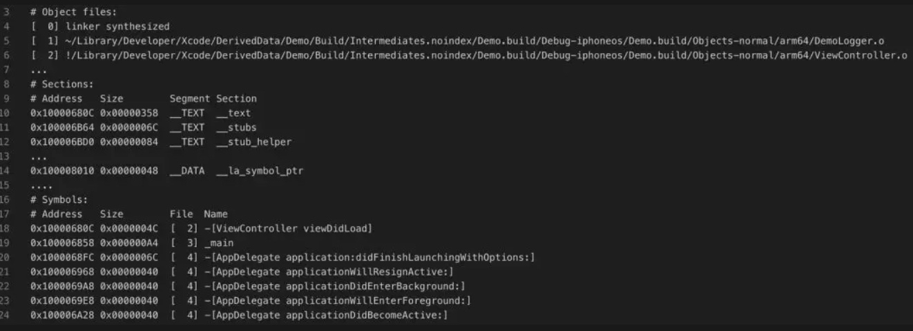

AirBrush 启动优化记录

# 优化手段

## 注册表写入machO
背景：组件化的库，都有一些实现app生命周期协议的实现。但是这些实现是用扫描所有类是否尊许某个协议/继承某个类的方式实现的。本地使用Instrument 检测耗时在70ms(14 pro max)左右, 线上在波动较大在500~1500ms

因此将注册表利用gcc `__attribute__` 标识符，在编译时写入machO文件。在运行时直接读取出来。 

```
struct PIXHG_String {
    char *moduleName; //swift需要, oc传""
    char *className; //遵循ModuleDelegate的相关类
};


#define __PR_CONCAT_(X, Y) X ## Y
#define __PR_CONCAT(X, Y) __PR_CONCAT_(X, Y)

#define PIXHG_Module_Register(moduleName, className) __attribute__((used, section("__DATA,__HGLaunchDATA"))) \
static const struct PIXHG_String __PR_CONCAT(__hg_string_, __COUNTER__) = (struct PIXHG_String){moduleName, className};
```

读出数据的方法
```
unsigned long byteCount = 0;
    uint8_t *data = NULL;
    
    uint32_t libCount = _dyld_image_count();
    for (uint32_t i = 0; i < libCount; i++) {
        const struct mach_header_64 *header =  (struct mach_header_64*)_dyld_get_image_header(i);
        data = getsectiondata(header, "__DATA", "__HGLaunchDATA", &byteCount);
        if (data != NULL) {
            break;
        }
    }
    
    //兜底逻辑,如果上面未获取到数据. 使用下面方法重试一下. 因为相对耗时,所以不优先使用
    if (data == NULL) {
        Dl_info info;
        dladdr((__bridge void *)[self class], &info);
        const struct mach_header_64 *header = (struct mach_header_64 *)info.dli_fbase;
        data = getsectiondata(header, "__DATA", "__HGLaunchDATA", &byteCount);
    }
    
    struct PIXHG_String *items = (struct PIXHG_String*)data;
    uint32_t count = (uint32_t)(byteCount / sizeof(struct PIXHG_String));
    NSMutableSet<Class >*set = [NSMutableSet set];
    
    for (uint32_t idx = 0; idx < count; ++idx) {
        NSString * moduleName = [NSString stringWithUTF8String:items[idx].moduleName];
        NSString * className = [NSString stringWithUTF8String:items[idx].className];
        NSString *full = [NSString stringWithFormat:@"%@.%@", moduleName, className];
        Class cls = NSClassFromString(full) ?: NSClassFromString(className) ;
        if (cls != nil ) {
            [set addObject:cls];
        }
    }
    NSArray<Class> *result = set.allObjects;
    
    for (Class cls in result) {
        NSLog(@"machO scan cls:%@", NSStringFromClass(cls));
    }
```


使用方法
```
#import "PIXABAuxiliaryModuleRegister.h"
#import <PIXHexGateObjc/PIXHGModuleContext.h>

PIXHG_Module_Register("PIXABAuxiliary", "PushModuleDelegate")
PIXHG_Module_Register("PIXABAuxiliary", "HomeModuleDelegate")
PIXHG_Module_Register("PIXABAuxiliary", "DataAnalyzeModuleDelegate")
PIXHG_Module_Register("PIXABAuxiliary", "AuxiliaryModuleDelegate")
PIXHG_Module_Register("PIXABAuxiliary", "AppActionModuleDelegate")

@implementation PIXABAuxiliaryModuleRegister

@end
```

### 遇到的问题
1. 宏定义如果写在单独的头文件中，且该文件未被其他文件引用，那就会导致该文件实际未参与编译 运行时无法读出
2. 如果将宏定义写到组件公共头文件中，且该头文件被多个文件导入，就会导致变量重复定义 编译会报错。
3. 同一个文件 多次使用该宏定义变量名会重复
4. swift 文件 无法使用gcc的编译属性
解决方案：
单独定义一个oc类，在.m中写宏定义。
利用gcc `__COUNTER__` 宏，区别同一个文件中的变量名，避免在PIXHG_Module_Register中传入id参数

## 动态库转为静态库
查看Frameworks文件下发现ab使用了太多的动态库：


在podfile中使用 `use_framework!`，会将第三库以动态库的形式集成，但不幸的是ab已经去掉了这个配置，那是否还有优化的空间？

逐个分析：
- 分析`podfile.lock`发现mtnn并没其他库 引用它，可直接移除
- 分析`podfile.lock`发现openssl，是`PIXABPhotoes` 和 `MTGID`在引用，但是photo实际没有用到，`MTGID`升级到新版本(查看新版的`podspec`)可以去掉这个依赖。
- 一些第三库，如pag / fb相关 / adjust 官网提供静态版本的，只是通过pod 只能是动态库，很奇怪。解决方案：通过本地pod 引用这些库

### 遇到的问题
1. 有依赖关系的库，如`mtlabrecord`和`MTAiInterface`，虽然`mtlabrecord` 提供静态库，但是`MTAiInterface`的`podspec` 是直接依赖动态库的，所以在主工程直接引用`mtlabrecord`的静态库子库是没有用的. 这种库，要先尝试修改上层依赖。
2. `MTAiInterface` 虽然文档和`podspec`都写的直接静态库，但是实际不提供
3. 证件照相关的库，`core`和`cordova` 在`podspec`中指定了需要`module_header`，而这种形式其实的库，不支持以静态库的形式引入；尝试将其他库变成静态库，打包会报错(本地运行不会，难道是Xcode版本不对？)。
4. 实施过程中，有遇到修改podfile后，但是使用的库还是动态库。是因为其他组件 可能还在依赖动态版本的库。如果修改正确，其实不用清缓存 重新编译的，直接编译就行
5. 遇到`podfile.lock`中有两个版本的第三库解决方案：先移除依赖该库的本地pod，直接`pod install`，如果失败，可以直接删除`podfile.lock`中不对的版本。
6. 本地pod, `:path => '文件夹路径'`, .json和.podspec 都是可以用的格式


## 启动耗时方法异步
主要是一些第三方库初始化和realm操作耗时。

### 遇到的问题
1. 主要是Instrument的Time Profiler没有检测出来这部分耗时，要本地打日志检测

## 二进制重排
目的：生成orderfile，指导编译器生成machO 让启动用到的方法集中到部分page，减少启动过程中的Page In(缺页中断)

原理：

>抖音：通过App Store渠道分发的App，Page Fault还会进行签名验证，而签名正是一次Page In耗时的大头。


如何检测？
使用System Trace选中主线程，查看Virtual Memory。**记得拖动轨道 选中从启动到第一帧渲染完的区间**，这个数据是准确的且没有太多波动。
之所以网上说这个数值变化大有两个原因：
- 没有重启手机。那上一次启动的内存没被系统回收，会影响这一次的结果
- 没有选中启动的区间，而是以启动到结束的整条轨道

关于linkmap:
可以看做是machO的描述，包含以下三部分：
- 链接所需的目标文件(.o)的路径和序号
- machO 所有的segment和section
- 所有符号及地址
比如


如何知道重排后有没有效果，就是查看linkmap中的符号，是否按orderfile中指定的顺序


不同方案对比和结果
### 抖音
静态库扫描linkmap:
- 正则识别+load方法
- __DATA，__mod_init_func 包含c++静态初始化方法，对其进行反汇编获取符号

- 动态trace:
fish hook `objc_msgSend`获取启动过程中的OC方法调用。

缺点：
- 无法获取部分block/c++静态方法
- Initialize获取不到
- swift方法获取不到

因为涉及反汇编 基本无法使用。


### clang插桩
原理：编译期插入统计代码。运行一次程序，统计代码会输出从启动到首帧展示用到的所有符号。

好处：swift/oc/c++/block 都能统计到

缺点：需要添加依赖，才能插入统计代码。因此三方库统计不到

操作
```
//引入 三方库
pod 'AppOrderFiles'

//添加flag
post_install do |installer|
  installer.pods_project.targets.each do |target|
    target.build_configurations.each do |config|
      config.build_settings['OTHER_CFLAGS'] = '-fsanitize-coverage=func,trace-pc-guard'
      config.build_settings['OTHER_SWIFT_FLAGS'] = '-sanitize-coverage=func -sanitize=undefined'
    end
  end
end
```
方案解释
1.添加flag后 需要添加对应的统计方法，不然编译报错
2.如果想要二方、三方库也统计进来，需要添加依赖，但是我们不可能改三方库的podspec，所以这个方法只能统计主工程，二方库的调用


### PGO
Profile Guided Optimization (PGO) .一项古老到已经归档的技术，类似于clang插桩，需要启动一下 生成一个文件：包含启动过程中用到的方法及调用频率，指导编译器优化machO的生成

### 效果
抖音的方案 需要反汇编 难度太大，一般没有人使用
clang插桩，实测page in反而增多。猜测是iOS 13以后会生成启动闭包，减少page in过程中的验签操作。但是这个page in增多着实不理解
pgo 无效，不增也不减


# 待尝试的方案

- 添加首帧的检测，是否可以尝试将首帧放到`appDidBecomeActive`之后
- 不同设备的性能不一样，一些高端机上的正常的，在低端机上可能会是性能瓶颈。因此要使用低端机在检测一次
- 不要删除tmp/com.apple.dyld目录，因为这个目录下存储着 iOS 13+的启动闭包，如果删除了下次启动会重新创建，创建闭包的过程是很慢的
>抖音：闭包是怎么提升启动速度的呢？我们先来看一下闭包里都有什么内容：
dependends，依赖动态库列表
fixup：bind & rebase 的地址
initializer-order：初始化调用顺序
optimizeObjc: Objective C 的元数据
其他：main entry, uuid…

- 再次尝试orderfile的重拍方案？看看linkmap 是否如期望
- 启动之后的hangs分析
- 动态库懒加载，解决底层库 无静态版本的问题
- 了解modular 相关的内容，是否可以将证件照的也改为静态库
-  System Trace 来看看上下文切换耗时，确认线程数量是否是启动的瓶颈？
-  启动任务调度器


# 后续的指导
1. 非必要不引入动态库
2. 使用initialize代替load
3. 启动过程中的业务，识别是否有必要在主线程中，是否有必要在首帧之前执行
4. 线程的qos
5. 关注低端机的性能瓶颈
