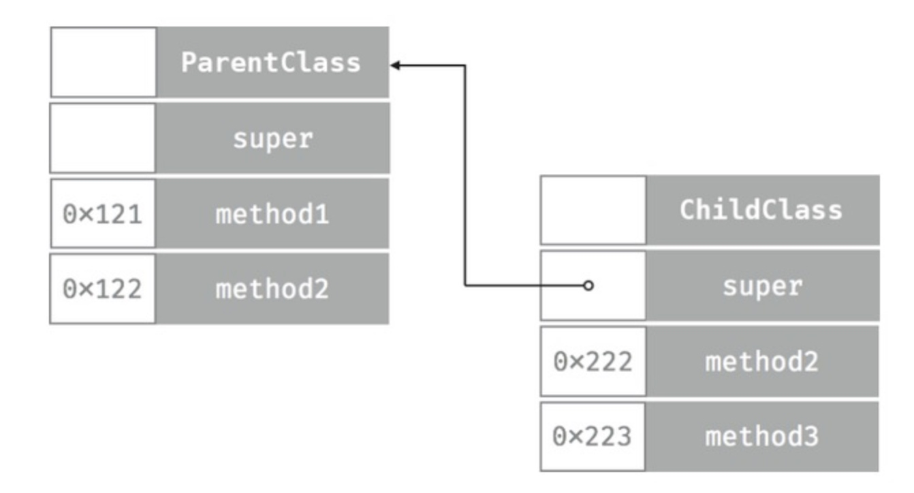

swift 与 oc异同, 及消息派发机制
 

# 一、对象

swift的类：从NSObject派生；没有指定父类，默认从SwiftObject派生

swift对象内存布局和oc相似，但并不完全一样。对象最开始有一个isa指向类的描述信息，该描述信息中包含一个虚函数表，为方法调用服务

Swift对象创建：堆内存分配，调用init构造函数。不像oc 明确的分为alloc和init两个步骤。在编译时给每个类生成构造和析构函数。比如

```
class CA {
   init(_ a:Int){}
}

//编译生成的对象内存分配创建和初始化函数代码
CA * XXX.CA.__allocating_init(swift_class  classCA,  int a)
{
    CA *obj = swift_allocObject(classCA);  //分配内存。
    obj->init(a);  //调用初始化函数。
}

//编译时还会生成对象的析构和内存销毁函数代码
XXX.CA.__deallocating_deinit(CA *obj)
{
   obj->deinit()  //调用析构函数
   swift_deallocClassInstance(obj);  //销毁对象分配的内存。
}

```

swift对象的生命周期也是和oc一样通过引用计数管理的

# 二、swift类中方法的调用
分三种：OC类的派生类并且重写了基类的方法、extension中的定义的方法、类中定义的常规方法

oc派生类，调用/重写 原oc方法，则还是走原来的objc_msgSend方法
oc派生类，新增自定义方法，使用虚函数表派发。虚函数表存在类对象中。

extension中定义的方法，在编译时决定，方法调用中的函数地址将会以硬编码的形式存在。在extension中无法再运行时做任何替换和改变，且方法函数的符号信息，不会保存到类的描述信息中。这解释了Swift派生类无法重写一个基类extension定义的方法

extension中是可以重写OC基类的方法，但是不能重写Swift类中的定义的方法？
为什么不太明白

类中定义的常规方法：通过虚函数表派发。swift实例中有一个isa成员变量，它指向类的描述信息，其中有一个虚函数表，每个条目保存着一个方法的函数地址。每一个对象方法的调用，在编译时就会转为从虚函数去对应偏移位置的函数地址来实现简介的函数调用。

swift每个类对象，都有改类所有的实例方法，加入子类重写了父类的方法，那么会出现子类和父类 同样索引位置的，保存不同的函数地址，这主要是为了实现多态。

如图所示：
```
class ParentClass {
    dynamic func method1() {}
    dynamic func method2() {}
}
class ChildClass: ParentClass {
    override func method2() {}
    dynamic func method3() {}
}
```




# 三、swift类中成员变量的访问
Swift和oc的共同之处：都有isa，实例变量排在它后面

oc特有：为成员变量生成一张表，记录着每个成员变量在对象内存中的偏移量，访问属性时就是通过这个偏移量，拿到对应成员变量；这个偏移量值的获取在编译链接时 硬编码完成

swift: 同oc一样生成set和get，但不会生成偏移量信息表。但是还有要通过偏移量来访问成员变量

# 四、结构体中的方法
结构体无isa，无类的描述信息。因此方法调用是编译时硬编码，与extension类似

# 五、类方法及全局函数
在编译链接时刻硬编码为函数地址调用来处理的

# 六、oc调用swift
@objc 方法在底层的逻辑：在编译时会生成两个函数，一个供swift本体调用；另一个跳板函数 是供oc语言调用的。

```
//本体函数foo的实现，记录在vtable中
void foo(){
}

 //跳板函数的实现 ，记录在oc类的方法列表
void trampoline_foo(id self, SEL _cmd){ 
asm("mov x20, x0"); 
self->isa->vtable[0](); //这里调用本体函数foo 
}
```

# 七、编译优化的方法调用
1. 最主要的 弱化通过虚函数表来间接调用方法的实现，而是大量改用了一些内联的方法

内联函数：被内联的方法，在调用的时候，不是通过虚函数表，而是直接将内联函数的指令拷贝过来。没有函数调用的跳转指令，而是直接执行方法定义中的指令
好处：加快执行速度
坏处：增加包体积

举例：
```
func add(_ a: Int, _ b: Int) -> Int {
    return a + b
}

let result = add(10, 20)  // 这里需要函数调用
let result = 10 + 20  // 直接替换，省去函数调用
```

2. 多态的优化
```
//classCB继承自classCA
void testfunc(CA *obj)
{
    //这里并不是通过虚表来进行间接调用而实现多态，而是直接硬编码通过类型判断来进行函数调用从而实现多态的能力。
    asm("mov x20, obj");
    if (obj->isa == &classCA)
         fooForA();
    else if (obj->isa == &classCB)
        fooForB();
}


```

# 八、其他
final 标记的方法会变成直接派发，提高性能，代价是损失了动态性、不支持继承


以上参考链接：https://juejin.cn/post/6844903889523884039#heading-6


# 九、以下是消息派发机制部分

## 不同派发机制的对比


| 类型          | 定义                                                                   | 优点                                      | 缺点                                 | 其他                                                           |
|---------------|------------------------------------------------------------------------|-------------------------------------------|:-------------------------------------|:---------------------------------------------------------------|
| 内联(inline)  | 将方法调用代码直接替换为 被调用方法的指令                              | 最快                                      | 增加包体积                           | 一般只是比较小的方法体 才适合转换为内联函数，这个一般是由系统决定 |
| 静态/直接派发 | 在编译时确定方法调用的地址，运行时直接跳转到对应地址代码执行            | 只比内联慢，比其他两种快                   | 缺乏动态性，无法实现继承              |                                                                |
| 虚函数表派发  | ①先通过isa找到类对象的vtable②再根据函数偏移 找到函数地址 ③跳转地址执行 | 比直接派发多了点动态性，支持多态和继承     | 相比直接派发多了两次查找             |                                                                Swift 中存在两种函数表，其中协议使用的是 witness_table (SIL 文件中名为 sil_witness_table)，类使用的是 virtual_table|
| 消息发送      | 通过objc_msgSend执行                                                   | 动态性最强，具体执行哪个方法是在运行时决定 | 最慢 方法查找耗时，需要缓存方法，又占用内存 |                                                                |


## swift派发机制

 |                  | 本体                                                               | extension | 关键字                                                                                                                                    |
|------------------|--------------------------------------------------------------------|-----------|:------------------------------------------------------------------------------------------------------------------------------------------|
| struct/enum      | 直接派发                                                           | 直接派发  |                                                                                                                                           |
| protocol         | 函数表                                                             | 直接派发  |                                                                                                                                           |
| 非NSObject派生类 | 函数表。被@objc描述后，是两种机制共存，swift类走函数表，oc类走消息机制 | 直接派发  | @objc 函数表和消息机制共存； @inline 转换为内联函数； final 转换为直接派发，优点提升性能，缺点损失动态性，不支持继承； static、类方法 是直接派发 |
| NSObject派生类   | 函数表                                                             | 直接派发  |                                                                                                                                           |关键字标记后是直接派发，提高性能； 代价是损失动态性，不支持继承。 @objc 暴露给oc runtime，两种机制共存。 @inline则转换为内联函数。 static/类方法 是直接调用的 |


大体原则：
- 值类型，如struct、enum, 因为没有类对象 存储vtable，因此都是直接派发
- 相应的引用类型，方法存储在vtable，因此默认是走函数表派发
- extension 默认是直接派发
- 关键字可以改变派发规则。如inline/static/final/@objc

参考：
https://juejin.cn/post/6847009771845845006#heading-10
https://juejin.cn/post/6844904120810209294?from=search-suggest


# 十、为什么使用Swift 而不是OC
- 表达能力 更强，如struct / enum / protocol / 泛型
- 更安全:类型是明确，不像oc 实际是id ; 是否有值也是明确的; 变量强制初始化；值类型的线程安全；泛型相比Any，类型约束更明确; 对象创建后，除了optional属性，其他的有值的，oc保证不了
- 更快：vtable派发； 值类型 如struct，也可以定义属性和方法，且他们内存分配和释放更快 ; 
- 持续迭代： async/await, swiftui, combine, swiftUI等

# 十一、 Swift语法拾遗

## 如何让你的swift代码性能更好
- 多使用struct，而不是class. 它在内存分配/释放上有更好的性能，且在多线程传递时，更安全，且struct是静态派发的，相比函数表和消息机制更快
- 使用final描述你的类。虽然final描述的类 不能继承，但是它里面的方法时直接派发的

## Copy On Write如何实现

什么是COW?
值类型在赋值的时候，仍然是指向原内存，只有在修改值的时候，才会真正触发copy操作

值类型中嵌套引用类型。
- 值类型在栈上，它持有一个指针，指向堆上的引用类型
- 此种值类型拷贝的时候，对于其中的引用类型，是浅拷贝，只是多一个指向它的指针

COW如何实现？
```
struct CoWSomeClass {
    init(value: Int) {
        storage = SomeClass(value: value)
    }

    private var storage: SomeClass

    var value: Int {
        get {
            storage.value
        }
        set {
            if !isKnownUniquelyReferenced(&storage) {
                storage = storage.copy()
            }
            storage.value = newValue
        }
    }
}

// Storage definition
extension CoWSomeClass {
    private class SomeClass {
        var value: Int

        init(value: Int) {
            self.value = value
        }

        func copy() -> SomeClass {
            SomeClass(value: value)
        }
    }
}
```

使用
```
var cow = CoWSomeClass(value: 1)
//此时有两个指针指向cow.storage对象
var cow1 = cow
//触发set操作时,判断isKnownUniquelyReferenced为false. 内部新生成一个
cow1.value = 2
```

核心：使用`isKnownUniquelyReferenced`判断是否只有一个指针指向该对象，如果有多个则copy.
注意该方法接受的是对象，因为要使用一个类包装一下。

## HashTable VS Set VS Dictionary VS NSMapTable
swift中无HashTable
两两对比的，NSHashTable和Set比较类似，都是直接添加对象的，不是k-v结构。NSHashTable可以指定内存策略
Dictionary 和 NSMapTable比较类似，都是k-v结构。NSMapTable可以指定key和value的内存策略


## 泛型
泛型的本质是参数化类型，即可以看做把类型当做参数传递？当类型确定之后 就不能再更改(即泛型要求类型一致)。
而Any只是不去检查类型，它随时随地，可以是任何类型。

它的类型，由调用者确定。

## 不透明类型
使用关键字some, **它表示实现某个协议的具体类型**。它确保任何一个调用该方法都将得到**同一个**遵循该协议的类型，即不透明类型没有多态。它一般用在方法的返回值上/计算属性。

```
//我们知道基本数据类型都遵循Equatable，但是在这里它就是String,不可能是其他类型
func makeA() -> some Equatable { 
 "A" 
}

//下面的实现将报错
func makeOneOrA(_ isOne: Bool) -> some Equatable { 
    isOne ? 1 : "A" 
    // ❌ Compilation error: Cannot convert return expression of type 'Int' to return type 'some Equatable'
} 


```

与泛型的区别
```
func foo<T: Equatable>() -> T { ... }

let x: Int = foo() // T == Int, chosen by caller
let y: String = foo() // T == String, chosen by caller
```
可以看到泛型**受调用者**约束

```
func bar() -> some Equatable { ... }

let z = bar() // z is abstracted to Equatable. Concrete type is chosen by bar() implementation

```
不透明类型受**被调用者**约束, 不透明类型有时称为“反向泛型”

## 类型擦除

何为类型擦除：隐藏具体类型
目的：解决泛型协议，无法直接作为类型的问题？

泛型协议使用及报错分析
```
protocol Generator {
    associatedtype AbstractType
    func generate() -> AbstractType
}

struct IntGenerator: Generator {
    typealias AbstractType = Int
    
    func generate() -> Int {
        return 0
    }
}

struct StringGenerator: Generator {
    typealias AbstractType = String
    
    func generate() -> String {
        return "zero"
    }
}

//直接使用Generator作为类型会报错
let value: Generator = arc4random()%2 == 0 ? IntGenerator() : StringStore()


//Error: Protocol 'Generator' can only be used as a generic constraint because it has Self or associated type requirements
```

Swift是强类型语言，所有类型必须在编译时确定。而泛型协议，因为没有Existential Container，并不能实现动态调用。

首先说明，如果不是泛型协议，即无关联类型的协议，是可以的。
但是加上了关联类型，直接使用协议作为类型，是无法直接推断出关联类型的具体类型的。

在简单处理如下, 加上 any即可：


如何手动实现类型擦除
- 定义一个【结构体中间层】，它实现泛型协议
- 在【结构体中间层】对于泛型协议的实现中，转发给【泛型协议的具体实现类】
- 在【结构体中间层】的初始化方法中，传入【泛型协议的具体实现】(依赖注入，也优点类似于装饰器模式)

举例：
```
protocol Generator {
    associatedtype AbstractType
    func generate() -> AbstractType
}

//中间层
struct GeneratorThunk<T>: Generator {
    private let _generate: () -> T
    
    //依赖注入
    init<G: Generator>(_ gen: G) where G.AbstractType == T {
        _generate = gen.generate
    }
    
    
    func generate() -> T {
    //转发具体实现
        return _generate()
    }
}
```

使用
```
//具体实现
struct StringGenerator: Generator {
    typealias AbstractType = String
    func generate() -> String {
        return "zero"
    }
}

let gens: GeneratorThunk<String> = GeneratorThunk(StringGenerator())

```

## 泛型、不透明、泛型的比较
- Generics中，是开发者不需要知道类型或协议，但是使用者知道类型或协议。
- Opaque中，是开发者知道协议，但是使用者不知道协议。（some Protocol）
- Type Erasure是在Generics的基础之上,通过盒子包装来规避编译器检查的一种方式。(any Protocol)


## weak/unowned
weak: 不增加引用计数，对象释放的时候 指针置为nil，因此weak指针总是可选类型的
unowned: 不增加引用计数，它总是假定指向的对象有值。如果没有值会有运行时错误，即崩溃。

## Capture List

### 懒捕获
即闭包运行时才捕获。意味着在闭包创建后，如果捕获的值发生了变化，它将使用最新的值。
```
var lazyVar = 1
let lazyCapture = {
    print("Lazy Capture: \(lazyVar)")
}
lazyVar = 2
lazyCapture()  // 输出 "Lazy Capture: 2"
```

### 早捕获
闭包创建的时候，显示捕获
```
var eagerVar = 1
let eagerCapture = { [eagerVar] in
    print("Eager Capture: \(eagerVar)")
}
eagerVar = 2
eagerCapture()  // 输出 "Eager Capture: 1"
```

## 可选值的原理
语法糖，底层是Optional枚举
```
//使⽤枚举，Wrapped 的英⽂是 使""...包裹的意思
enum Optional<Wrapped> {
  case none
  case some(Wrapped)
}

//这是个语法糖，下⾯两种形式等价：
var name: Optional<String>
var name: String?
```

## Lazy
作用：
- 延迟初始化
- 只执行一次
- 不是线程安全的

原理：
创建一个LazyValue的模版类，内部会先判断有没有值，没有的话调用初始化方法，有的话直接返回。
https://github.com/swiftlang/swift/blob/main/include/swift/Basic/Lazy.h
```
template <typename T, typename Initializer = std::function<T()>>
class LazyValue {
  Initializer Init;
  std::optional<T> Value;

public:
  LazyValue(Initializer Init) : Init(Init){};

  T &get() {
    if (!Value.has_value()) {
      Value = Init();
    }
    return Value.value();
  }

  T *operator->() { return &get(); }
  T &operator*() { return get(); }
};
```