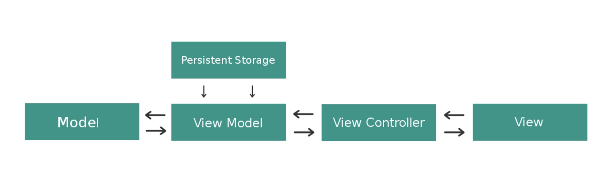

架构设计专项

# MVVM



首先忽略，其中都是实线箭头的错误。但是它展示mvvm中应有的模块，以及是否可以直接访问。

相比mvc, 它多了viewmodel和storage 这两个类。假想一下，你任然在使用mvc，那么你将在vc中处理model数据的格式化，在vc中发起请求。而在mvvm中这些工作，分别被划分到了viewmodel和storage中。

**view和viewmodel 互不持有对方，在vc中通过绑定**

## 各部分职责如下
- model: 业务数据，及封装数据的操作。严格来说 model中的数据应该是只读的，外界通过其提供的方法来操作数据
- viewmodel: 将model中的数据化格式化，让其能够显示到view上；响应view的操作，执行数据更新；持有network/db 执行数据的增删改查。
- vc: 建立 viewmodel 和 view的绑定关系
- view: 渲染viewmodel的数据；分发用户交互事件。

## 为什么谈到mvvm的时候,总会谈到rx等框架
1. 从viewmodel的职责来说：
- viewmodel是对model中的要显示到view上数据的格式化, 比较方便的处理方式是, 数据一更新 UI立马做出响应
- viewmodel要对view中事件做出响应, UI事件一触发,viewmodel 即做出对应的动作 去更新数据
所以,可以看到viewModel和view是紧密联系的，数据从viewmodel流向view; 事件从view流向viewmodel。


2. 从代码的维护上看
如果不用rx 而使用系统的delegate/block等方式,容易导致处理逻辑的碎片化,降低代码的可读性. 就需要自己处理这种绑定关系
比如: View通过delegate通知外部事件触发, 此时vc调用viewModel的方法去更新数据,大概率是异步的, 此时viewModel需要通过block等形式告知vc数据更新完成,进而刷新UI.

```
 // MARK: 绑定 ViewModel
    private func setupViewModel() {
        let sampleUser = User(username: "初始用户", registerDate: Date())
        viewModel = UserViewModel(user: sampleUser)
        
        // 设置数据更新回调
        viewModel.updateUI = { [weak self] in
        //②更新完成 刷新UI
            self?.updateDataDisplay()
        }
        
        // 初始数据加载
        updateDataDisplay()
    }
    
    // MARK: 更新 UI 数据
    private func updateDataDisplay() {
        nameLabel.text = viewModel.displayName
        dateLabel.text = "注册日期: \(viewModel.formattedDate)"
    }
    
    // MARK: 用户事件处理
    @objc private func renameAction() {
        let alert = UIAlertController(title: "修改名称", message: nil, preferredStyle: .alert)
        alert.addTextField { $0.placeholder = "输入新名称" }
        
        let action = UIAlertAction(title: "确认", style: .default) { [weak self] _ in
            guard let newName = alert.textFields?.first?.text else { return }
            //① 用户事件触发，驱动viewmodel 更新数据
            self?.viewModel.didTapRenameButton(newName: newName)
        }
        
        alert.addAction(action)
        present(alert, animated: true)
    }
```


3. 使用rx的好处
viewmodel和view, 在vc中通过rx建立联系，但双方并没有直接的持有对方，减少耦合。

# MVP


## 职责划分
- Model层：同mvc/mvvm，数据实体，数据封装
- View层：指的是UIView和ViewController
- presenter: 接受view事件，更新model，刷新UI。

按照这个职责划分，相当于在presenter中完成了model和view的绑定。看出来了吗？它有点像mvc中vc. 但为了避免退化为mvc, 比较推荐将业务分块，一个模块有对应的view和presenter，避免所有的代码都堆积到一个p中 这样就和mvc一样了。

## 假如你是使用的无rx的mvvm，那其实更推荐你使用mvp.
因为在无rx的mvvm中，UI触发->VC中的delegate/block 接受事件->VM更新数据->刷新UI。这条链路的绑定是松散的。如果使用mvp，每个模块的绑定操作，都集中到一个presenter 就相对清晰

## 举例
```
// MARK: - Model层
struct User {
    var username: String
    let registerDate: Date
}

// MARK: - View协议（抽象接口）
protocol UserViewProtocol: AnyObject {
    func updateNameDisplay(_ text: String)
    func updateDateDisplay(_ text: String)
}

// MARK: - Presenter层
class UserPresenter {
    // MARK: 数据存储
    private var user: User {
        didSet {
            updateView()
        }
    }
    
    // MARK: 视图引用（弱持有）
    private weak var view: UserViewProtocol?
    
    // MARK: 初始化
    init(user: User, view: UserViewProtocol) {
        self.user = user
        self.view = view
    }
    
    // MARK: 数据格式化
    private func formatDate(_ date: Date) -> String {
        let formatter = DateFormatter()
        formatter.dateStyle = .medium
        formatter.timeStyle = .none
        return formatter.string(from: date)
    }
    
    // MARK: 视图更新
    func updateView() {
        view?.updateNameDisplay("用户: \(user.username)")
        view?.updateDateDisplay("注册时间: \(formatDate(user.registerDate))")
    }
    
    // MARK: 事件处理
    func handleRenameRequest(newName: String) {
        // 模拟异步操作
        DispatchQueue.global().asyncAfter(deadline: .now() + 0.5) {
            let updatedUser = User(username: newName, registerDate: self.user.registerDate)
            
            // 主线程更新
            DispatchQueue.main.async {
                self.user = updatedUser
            }
        }
    }
}

// MARK: - View层实现（ViewController）
class UserViewController: UIViewController, UserViewProtocol {
    // UI组件
    private let nameLabel = UILabel()
    private let dateLabel = UILabel()
    private let renameButton = UIButton(type: .system)
    
    // Presenter引用
    private var presenter: UserPresenter!
    
    override func viewDidLoad() {
        super.viewDidLoad()
        setupUI()
        setupPresenter()
    }
    
    // MARK: UI初始化
    private func setupUI() {
        // 布局代码省略...
        renameButton.setTitle("修改名称", for: .normal)
        renameButton.addTarget(self, action: #selector(renameAction), for: .touchUpInside)
    }
    
    // MARK: Presenter初始化
    private func setupPresenter() {
        let sampleUser = User(username: "初始用户", registerDate: Date())
        presenter = UserPresenter(user: sampleUser, view: self)
        presenter.updateView()
    }
    
    // MARK: View协议实现
    func updateNameDisplay(_ text: String) {
        nameLabel.text = text
    }
    
    func updateDateDisplay(_ text: String) {
        dateLabel.text = text
    }
    
    // MARK: 用户事件
    @objc private func renameAction() {
        let alert = UIAlertController(title: "修改用户名", message: nil, preferredStyle: .alert)
        alert.addTextField { $0.placeholder = "输入新名称" }
        
        let confirmAction = UIAlertAction(title: "确认", style: .default) { [weak self] _ in
            guard let newName = alert.textFields?.first?.text else { return }
            self?.presenter.handleRenameRequest(newName: newName)
        }
        
        alert.addAction(confirmAction)
        present(alert, animated: true)
    }
}

```

核心在于Presenter同时持有model和(weak的)view。

# mvp 和 mvvm 实战建议 及对比


尝试使用 property wrapper 实现绑定，如果方便那还用什么 rx
尝试在一些复杂逻辑的部分 使用mvp, 类似于 duffle素材展示